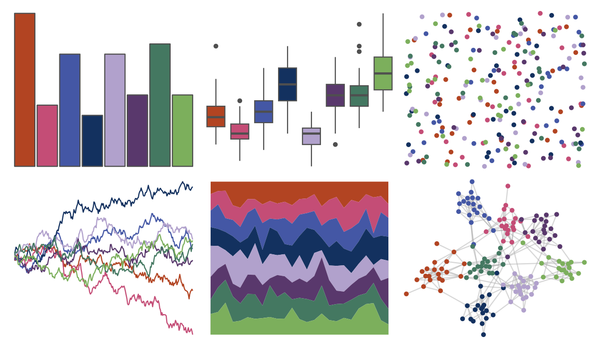

# MetBrewer - Thomas 

::: columns
::: {.column width="50%"}

**Github**

[BlakeRMills/MetBrewer](https://github.com/BlakeRMills/MetBrewer)
:::

::: {.column width="50%"}

**CRAN**

[MetBrewer](https://CRAN.R-project.org/package=MetBrewer)
:::
:::

<hr> 

Use with [paletteer](https://emilhvitfeldt.github.io/paletteer/) package:

```r
library(paletteer)
paletteer_d("MetBrewer::Thomas")
```

Use raw:

```r
c("#B24422FF", "#C44D76FF", "#4457A5FF", "#13315FFF", "#B1A1CCFF", "#59386CFF", "#447861FF", "#7CAF5CFF")
``` 

 

<br>

# Related Palettes

<div class="list" style="display: grid; grid-template-columns: auto auto auto;"> <figure class="figure">
<a href="../../awtools/a_palette/"> </a>
</figure> <figure class="figure">
<a href="../../ButterflyColors/hamadryas_feronia/"> </a>
</figure> <figure class="figure">
<a href="../../ButterflyColors/hamadryas_feronia/"> </a>
</figure> <figure class="figure">
<a href="../../Manu/Takahe/"> </a>
</figure> <figure class="figure">
<a href="../../fishualize/Oncorhynchus_nerka/"> </a>
</figure> <figure class="figure">
<a href="../../ggsci/hallmarks_light_cosmic/"> </a>
</figure> <figure class="figure">
<a href="../../lisa/ClaudeMonet_1/"> </a>
</figure> <figure class="figure">
<a href="../../DresdenColor/briefcases/"> </a>
</figure> <figure class="figure">
<a href="../../rockthemes/husker/"> </a>
</figure> <figure class="figure">
<a href="../../NatParksPalettes/Volcanoes/"> </a>
</figure> <figure class="figure">
<a href="../../MetBrewer/Klimt/"> </a>
</figure> <figure class="figure">
<a href="../../MoMAColors/Sidhu/"> </a>
</figure> 
</div>
