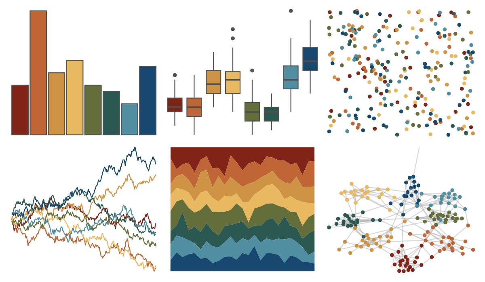

# MetBrewer - Tiepolo 

::: columns
::: {.column width="50%"}

**Github**

[BlakeRMills/MetBrewer](https://github.com/BlakeRMills/MetBrewer)
:::

::: {.column width="50%"}

**CRAN**

[MetBrewer](https://CRAN.R-project.org/package=MetBrewer)
:::
:::

<hr> 

Use with [paletteer](https://emilhvitfeldt.github.io/paletteer/) package:

```r
library(paletteer)
paletteer_d("MetBrewer::Tiepolo")
```

Use raw:

```r
c("#802417FF", "#C06636FF", "#CE9344FF", "#E8B960FF", "#646E3BFF", "#2B5851FF", "#508EA2FF", "#17486FFF")
``` 

 

<br>

# Related Palettes

<div class="list" style="display: grid; grid-template-columns: auto auto auto;"> <figure class="figure">
<a href="../../amerika/Dem_Ind_Rep3/"> </a>
</figure> <figure class="figure">
<a href="../../NatParksPalettes/GrandCanyon/"> </a>
</figure> <figure class="figure">
<a href="../../MetBrewer/Hokusai1/"> </a>
</figure> <figure class="figure">
<a href="../../poisonfrogs/Ramazonica/"> </a>
</figure> <figure class="figure">
<a href="../../ghibli/PonyoMedium/"> </a>
</figure> <figure class="figure">
<a href="../../lisa/EdvardMunch/"> </a>
</figure> <figure class="figure">
<a href="../../NatParksPalettes/Torres/"> </a>
</figure> <figure class="figure">
<a href="../../futurevisions/pegasi/"> </a>
</figure> <figure class="figure">
<a href="../../MoMAColors/Rattner/"> </a>
</figure> <figure class="figure">
<a href="../../ggthemes/excel_Aspect/"> </a>
</figure> <figure class="figure">
<a href="../../futurevisions/grand_tour/"> </a>
</figure> <figure class="figure">
<a href="../../MetBrewer/Redon/"> </a>
</figure> 
</div>
