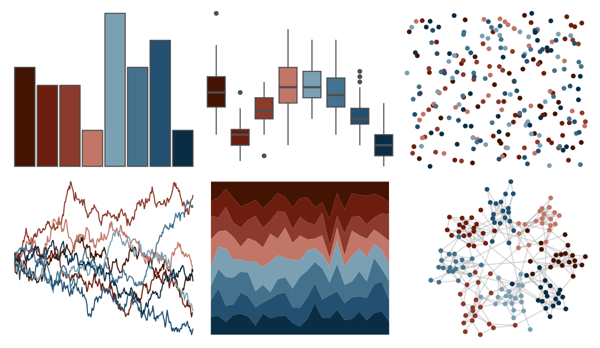

# MetBrewer - Troy 

::: columns
::: {.column width="50%"}

**Github**

[BlakeRMills/MetBrewer](https://github.com/BlakeRMills/MetBrewer)
:::

::: {.column width="50%"}

**CRAN**

[MetBrewer](https://CRAN.R-project.org/package=MetBrewer)
:::
:::

<hr> 

Use with [paletteer](https://emilhvitfeldt.github.io/paletteer/) package:

```r
library(paletteer)
paletteer_d("MetBrewer::Troy")
```

Use raw:

```r
c("#421401FF", "#6C1D0EFF", "#8B3A2BFF", "#C27668FF", "#7BA0B4FF", "#44728CFF", "#235070FF", "#0A2D46FF")
``` 

 

<br>

# Related Palettes

<div class="list" style="display: grid; grid-template-columns: auto auto auto;"> <figure class="figure">
<a href="../../awtools/a_palette/"> </a>
</figure> <figure class="figure">
<a href="../../ButterflyColors/hamadryas_feronia/"> </a>
</figure> <figure class="figure">
<a href="../../ButterflyColors/hamadryas_feronia/"> </a>
</figure> <figure class="figure">
<a href="../../nbapalettes/bobcats/"> </a>
</figure> <figure class="figure">
<a href="../../beyonce/X106/"> </a>
</figure> <figure class="figure">
<a href="../../unikn/pal_unikn_dark/"> </a>
</figure> <figure class="figure">
<a href="../../MoMAColors/Sidhu/"> </a>
</figure> <figure class="figure">
<a href="../../nbapalettes/rockets_90s/"> </a>
</figure> <figure class="figure">
<a href="../../nbapalettes/pistons/"> </a>
</figure> <figure class="figure">
<a href="../../calecopal/superbloom3/"> </a>
</figure> <figure class="figure">
<a href="../../yarrr/eternal/"> </a>
</figure> <figure class="figure">
<a href="../../nbapalettes/pistons_city/"> </a>
</figure> 
</div>
