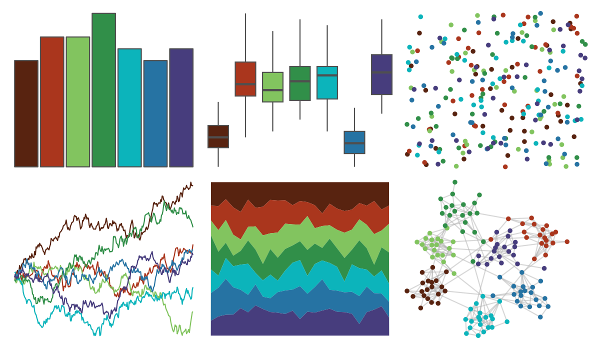

# MetBrewer - Tsimshian 

::: columns
::: {.column width="50%"}

**Github**

[BlakeRMills/MetBrewer](https://github.com/BlakeRMills/MetBrewer)
:::

::: {.column width="50%"}

**CRAN**

[MetBrewer](https://CRAN.R-project.org/package=MetBrewer)
:::
:::

<hr> 

Use with [paletteer](https://emilhvitfeldt.github.io/paletteer/) package:

```r
library(paletteer)
paletteer_d("MetBrewer::Tsimshian")
```

Use raw:

```r
c("#582310FF", "#AA361DFF", "#82C45FFF", "#318F49FF", "#0CB4BBFF", "#2673A3FF", "#473D7DFF")
``` 

 

<br>

# Related Palettes

<div class="list" style="display: grid; grid-template-columns: auto auto auto;"> <figure class="figure">
<a href="../../amerika/Dem_Ind_Rep3/"> </a>
</figure> <figure class="figure">
<a href="../../beyonce/X40/"> </a>
</figure> <figure class="figure">
<a href="../../waRhol/bighorn_ram_83/"> </a>
</figure> <figure class="figure">
<a href="../../fishualize/Etheostoma_spectabile/"> </a>
</figure> <figure class="figure">
<a href="../../MoMAColors/Ohchi/"> </a>
</figure> <figure class="figure">
<a href="../../Manu/Kakariki/"> </a>
</figure> <figure class="figure">
<a href="../../MoMAColors/VanGogh/"> </a>
</figure> <figure class="figure">
<a href="../../palettetown/starterspairs/"> </a>
</figure> <figure class="figure">
<a href="../../trekcolors/bajoran/"> </a>
</figure> <figure class="figure">
<a href="../../nbapalettes/timberwolves/"> </a>
</figure> <figure class="figure">
<a href="../../ggthemr/fresh/"> </a>
</figure> <figure class="figure">
<a href="../../ghibli/MarnieMedium1/"> </a>
</figure> 
</div>
