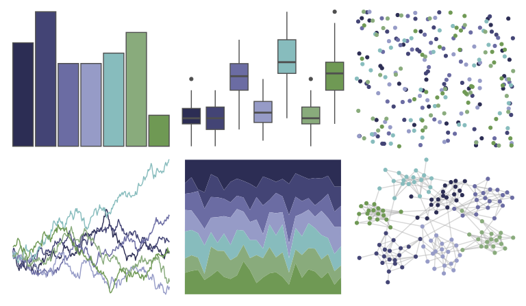

# MetBrewer - VanGogh1 

::: columns
::: {.column width="50%"}

**Github**

[BlakeRMills/MetBrewer](https://github.com/BlakeRMills/MetBrewer)
:::

::: {.column width="50%"}

**CRAN**

[MetBrewer](https://CRAN.R-project.org/package=MetBrewer)
:::
:::

<hr> 

Use with [paletteer](https://emilhvitfeldt.github.io/paletteer/) package:

```r
library(paletteer)
paletteer_d("MetBrewer::VanGogh1")
```

Use raw:

```r
c("#2C2D54FF", "#434475FF", "#6B6CA3FF", "#969BC7FF", "#87BCBDFF", "#89AB7CFF", "#6F9954FF")
``` 

 

<br>

# Related Palettes

<div class="list" style="display: grid; grid-template-columns: auto auto auto;"> <figure class="figure">
<a href="../../awtools/a_palette/"> </a>
</figure> <figure class="figure">
<a href="../../vapeplot/seapunk/"> </a>
</figure> <figure class="figure">
<a href="../../vapoRwave/seaPunk/"> </a>
</figure> <figure class="figure">
<a href="../../calecopal/lupinus/"> </a>
</figure> <figure class="figure">
<a href="../../nord/baie_mouton/"> </a>
</figure> <figure class="figure">
<a href="../../beyonce/X47/"> </a>
</figure> <figure class="figure">
<a href="../../trekcolors/andorian/"> </a>
</figure> <figure class="figure">
<a href="../../nord/silver_mine/"> </a>
</figure> <figure class="figure">
<a href="../../MetBrewer/Pissaro/"> </a>
</figure> <figure class="figure">
<a href="../../severance/Half/"> </a>
</figure> <figure class="figure">
<a href="../../MetBrewer/Cassatt2/"> </a>
</figure> <figure class="figure">
<a href="../../lisa/GeorgiaOKeeffe/"> </a>
</figure> 
</div>
