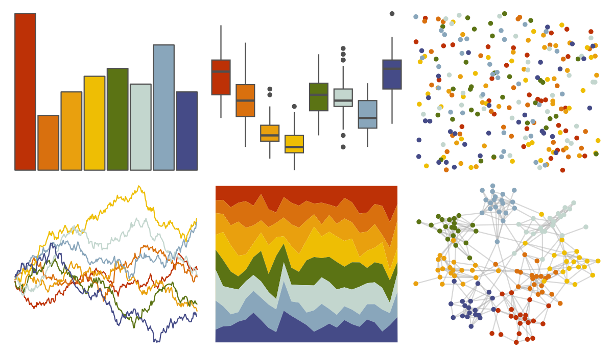

# MetBrewer - VanGogh2 

::: columns
::: {.column width="50%"}

**Github**

[BlakeRMills/MetBrewer](https://github.com/BlakeRMills/MetBrewer)
:::

::: {.column width="50%"}

**CRAN**

[MetBrewer](https://CRAN.R-project.org/package=MetBrewer)
:::
:::

<hr> 

Use with [paletteer](https://emilhvitfeldt.github.io/paletteer/) package:

```r
library(paletteer)
paletteer_d("MetBrewer::VanGogh2")
```

Use raw:

```r
c("#BD3106FF", "#D9700EFF", "#E9A00EFF", "#EEBE04FF", "#5B7314FF", "#C3D6CEFF", "#89A6BBFF", "#454B87FF")
``` 

 

<br>

# Related Palettes

<div class="list" style="display: grid; grid-template-columns: auto auto auto;"> <figure class="figure">
<a href="../../awtools/a_palette/"> </a>
</figure> <figure class="figure">
<a href="../../MetBrewer/Hiroshige/"> </a>
</figure> <figure class="figure">
<a href="../../vapoRwave/jwz/"> </a>
</figure> <figure class="figure">
<a href="../../IslamicArt/istanbul2/"> </a>
</figure> <figure class="figure">
<a href="../../werpals/jozi/"> </a>
</figure> <figure class="figure">
<a href="../../feathers/rose_crowned_fruit_dove/"> </a>
</figure> <figure class="figure">
<a href="../../colRoz/uluru/"> </a>
</figure> <figure class="figure">
<a href="../../MetBrewer/Hokusai1/"> </a>
</figure> <figure class="figure">
<a href="../../Redmonder/qMSOMrq/"> </a>
</figure> <figure class="figure">
<a href="../../LaCroixColoR/Tangerine/"> </a>
</figure> <figure class="figure">
<a href="../../lisa/PabloPicasso_1/"> </a>
</figure> <figure class="figure">
<a href="../../rtist/picasso/"> </a>
</figure> 
</div>
