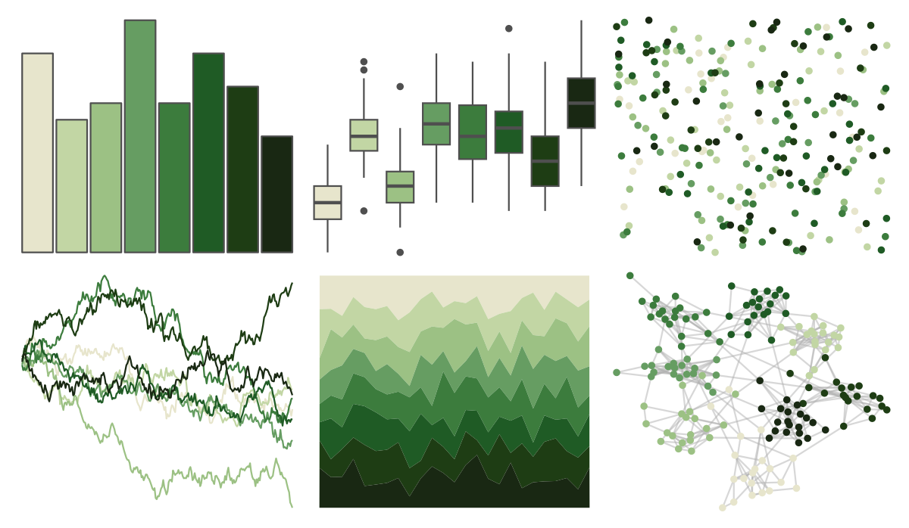
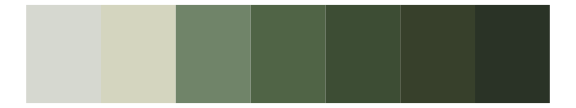

# MetBrewer - VanGogh3 

::: columns
::: {.column width="50%"}

**Github**

[BlakeRMills/MetBrewer](https://github.com/BlakeRMills/MetBrewer)
:::

::: {.column width="50%"}

**CRAN**

[MetBrewer](https://CRAN.R-project.org/package=MetBrewer)
:::
:::

<hr> 

Use with [paletteer](https://emilhvitfeldt.github.io/paletteer/) package:

```r
library(paletteer)
paletteer_d("MetBrewer::VanGogh3")
```

Use raw:

```r
c("#E7E5CCFF", "#C2D6A4FF", "#9CC184FF", "#669D62FF", "#3C7C3DFF", "#1F5B25FF", "#1E3D14FF", "#192813FF")
``` 

 

<br>

# Related Palettes

<div class="list" style="display: grid; grid-template-columns: auto auto auto;"> <figure class="figure">
<a href="../../awtools/a_palette/"> </a>
</figure> <figure class="figure">
<a href="../../ButterflyColors/hamadryas_feronia/"> </a>
</figure> <figure class="figure">
<a href="../../ButterflyColors/hamadryas_feronia/"> </a>
</figure> <figure class="figure">
<a href="../../werpals/monet/"> </a>
</figure> <figure class="figure">
<a href="../../calecopal/chaparral3/"> </a>
</figure> <figure class="figure">
<a href="../../tvthemes/EarthKingdom/"> </a>
</figure> <figure class="figure">
<a href="../../ghibli/MarnieMedium2/"> </a>
</figure> <figure class="figure">
<a href="../../ggsci/green_material/"> </a>
</figure> <figure class="figure">
<a href="../../MoMAColors/Alkalay2/"> </a>
</figure> <figure class="figure">
<a href="../../MexBrewer/Concha/"> </a>
</figure> <figure class="figure">
<a href="../../RColorBrewer/Greens/"> </a>
</figure> <figure class="figure">
<a href="../../palettetown/gulpin/"> </a>
</figure> 
</div>
