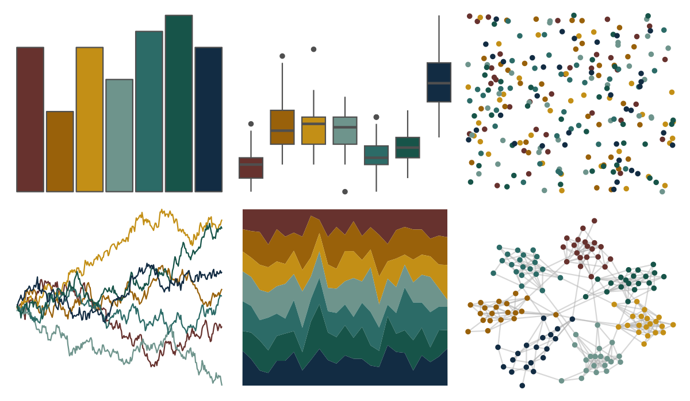

# MetBrewer - Veronese 

::: columns
::: {.column width="50%"}

**Github**

[BlakeRMills/MetBrewer](https://github.com/BlakeRMills/MetBrewer)
:::

::: {.column width="50%"}

**CRAN**

[MetBrewer](https://CRAN.R-project.org/package=MetBrewer)
:::
:::

<hr> 

Use with [paletteer](https://emilhvitfeldt.github.io/paletteer/) package:

```r
library(paletteer)
paletteer_d("MetBrewer::Veronese")
```

Use raw:

```r
c("#67322EFF", "#99610AFF", "#C38F16FF", "#6E948CFF", "#2C6B67FF", "#175449FF", "#122C43FF")
``` 

 

<br>

# Related Palettes

<div class="list" style="display: grid; grid-template-columns: auto auto auto;"> <figure class="figure">
<a href="../../amerika/Dem_Ind_Rep3/"> </a>
</figure> <figure class="figure">
<a href="../../calecopal/sierra1/"> </a>
</figure> <figure class="figure">
<a href="../../nbapalettes/heat_military/"> </a>
</figure> <figure class="figure">
<a href="../../NatParksPalettes/GrandCanyon/"> </a>
</figure> <figure class="figure">
<a href="../../MetBrewer/Tiepolo/"> </a>
</figure> <figure class="figure">
<a href="../../ggthemr/fresh/"> </a>
</figure> <figure class="figure">
<a href="../../tayloRswift/SunriseBoulevard1989/"> </a>
</figure> <figure class="figure">
<a href="../../calecopal/superbloom3/"> </a>
</figure> <figure class="figure">
<a href="../../ghibli/KikiMedium/"> </a>
</figure> <figure class="figure">
<a href="../../MetBrewer/Nattier/"> </a>
</figure> <figure class="figure">
<a href="../../Manu/Korimako/"> </a>
</figure> <figure class="figure">
<a href="../../ggthemes/excel_Aspect/"> </a>
</figure> 
</div>
