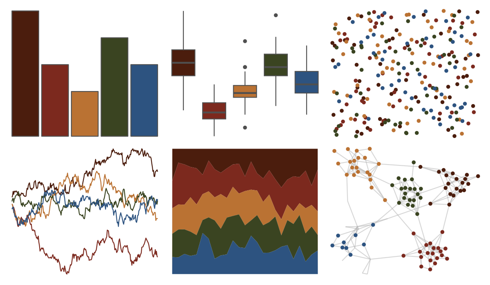

# MetBrewer - Wissing 

::: columns
::: {.column width="50%"}

**Github**

[BlakeRMills/MetBrewer](https://github.com/BlakeRMills/MetBrewer)
:::

::: {.column width="50%"}

**CRAN**

[MetBrewer](https://CRAN.R-project.org/package=MetBrewer)
:::
:::

<hr> 

Use with [paletteer](https://emilhvitfeldt.github.io/paletteer/) package:

```r
library(paletteer)
paletteer_d("MetBrewer::Wissing")
```

Use raw:

```r
c("#4B1D0DFF", "#7C291EFF", "#BA7233FF", "#3A4421FF", "#2D5380FF")
``` 

 

<br>

# Related Palettes

<div class="list" style="display: grid; grid-template-columns: auto auto auto;"> <figure class="figure">
<a href="../../awtools/a_palette/"> </a>
</figure> <figure class="figure">
<a href="../../ButterflyColors/hamadryas_feronia/"> </a>
</figure> <figure class="figure">
<a href="../../ButterflyColors/hamadryas_feronia/"> </a>
</figure> <figure class="figure">
<a href="../../lisa/AmedeoModigliani/"> </a>
</figure> <figure class="figure">
<a href="../../colRoz/m_horridus/"> </a>
</figure> <figure class="figure">
<a href="../../lisa/Masaccio/"> </a>
</figure> <figure class="figure">
<a href="../../nord/lake_superior/"> </a>
</figure> <figure class="figure">
<a href="../../lisa/JanvanEyck/"> </a>
</figure> <figure class="figure">
<a href="../../MetBrewer/Nattier/"> </a>
</figure> <figure class="figure">
<a href="../../ghibli/PonyoDark/"> </a>
</figure> <figure class="figure">
<a href="../../colRoz/capricorn/"> </a>
</figure> <figure class="figure">
<a href="../../NineteenEightyR/sunset2/"> </a>
</figure> 
</div>
