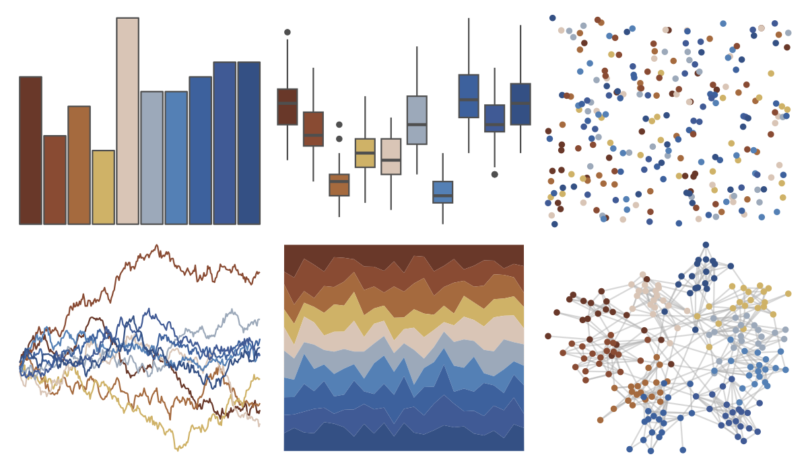

# MexBrewer - Alacena 

::: columns
::: {.column width="50%"}

**Github**

[paezha/MexBrewer](https://github.com/paezha/MexBrewer)
:::

::: {.column width="50%"}

**CRAN**

Not on CRAN
:::
:::

<hr> 

Use with [paletteer](https://emilhvitfeldt.github.io/paletteer/) package:

```r
library(paletteer)
paletteer_d("MexBrewer::Alacena")
```

Use raw:

```r
c("#693829FF", "#894B33FF", "#A56A3EFF", "#CFB267FF", "#D9C5B6FF", "#9CA9BAFF", "#5480B5FF", "#3D619DFF", "#405A95FF", "#345084FF")
``` 

 

<br>

# Related Palettes

<div class="list" style="display: grid; grid-template-columns: auto auto auto;"> <figure class="figure">
<a href="../../awtools/a_palette/"> </a>
</figure> <figure class="figure">
<a href="../../ButterflyColors/hamadryas_feronia/"> </a>
</figure> <figure class="figure">
<a href="../../ButterflyColors/hamadryas_feronia/"> </a>
</figure> <figure class="figure">
<a href="../../impressionist.colors/la_chanson_du_chien/"> </a>
</figure> <figure class="figure">
<a href="../../impressionist.colors/fleurs_dans_un_vase_de_cristal/"> </a>
</figure> <figure class="figure">
<a href="../../MoMAColors/Picabia/"> </a>
</figure> <figure class="figure">
<a href="../../beyonce/X60/"> </a>
</figure> <figure class="figure">
<a href="../../ghibli/PonyoMedium/"> </a>
</figure> <figure class="figure">
<a href="../../MoMAColors/Levine1/"> </a>
</figure> <figure class="figure">
<a href="../../MoMAColors/Levine2/"> </a>
</figure> <figure class="figure">
<a href="../../nord/halifax_harbor/"> </a>
</figure> <figure class="figure">
<a href="../../peRReo/wyy/"> </a>
</figure> 
</div>
