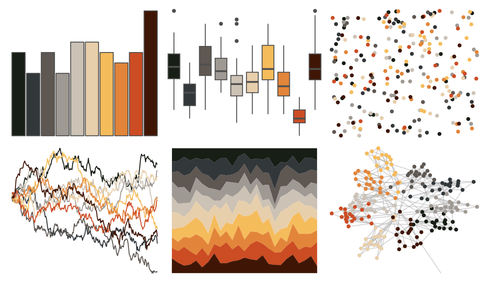

# MexBrewer - Atentado 

::: columns
::: {.column width="50%"}

**Github**

[paezha/MexBrewer](https://github.com/paezha/MexBrewer)
:::

::: {.column width="50%"}

**CRAN**

Not on CRAN
:::
:::

<hr> 

Use with [paletteer](https://emilhvitfeldt.github.io/paletteer/) package:

```r
library(paletteer)
paletteer_d("MexBrewer::Atentado")
```

Use raw:

```r
c("#171E15FF", "#32373AFF", "#5E5752FF", "#9F9994FF", "#CCC2B5FF", "#E8CFABFF", "#F5BC5CFF", "#E2853AFF", "#CC4C24FF", "#3F1606FF")
``` 

 

<br>

# Related Palettes

<div class="list" style="display: grid; grid-template-columns: auto auto auto;"> <figure class="figure">
<a href="../../amerika/Dem_Ind_Rep3/"> </a>
</figure> <figure class="figure">
<a href="../../futurevisions/pegasi/"> </a>
</figure> <figure class="figure">
<a href="../../MetBrewer/Demuth/"> </a>
</figure> <figure class="figure">
<a href="../../palettetown/houndour/"> </a>
</figure> <figure class="figure">
<a href="../../palettetown/makuhita/"> </a>
</figure> <figure class="figure">
<a href="../../NatParksPalettes/Torres/"> </a>
</figure> <figure class="figure">
<a href="../../palettetown/houndoom/"> </a>
</figure> <figure class="figure">
<a href="../../MetBrewer/Redon/"> </a>
</figure> <figure class="figure">
<a href="../../palettetown/gloom/"> </a>
</figure> <figure class="figure">
<a href="../../MexBrewer/Vendedora/"> </a>
</figure> <figure class="figure">
<a href="../../NatParksPalettes/Acadia/"> </a>
</figure> <figure class="figure">
<a href="../../ggthemr/pale/"> </a>
</figure> 
</div>
