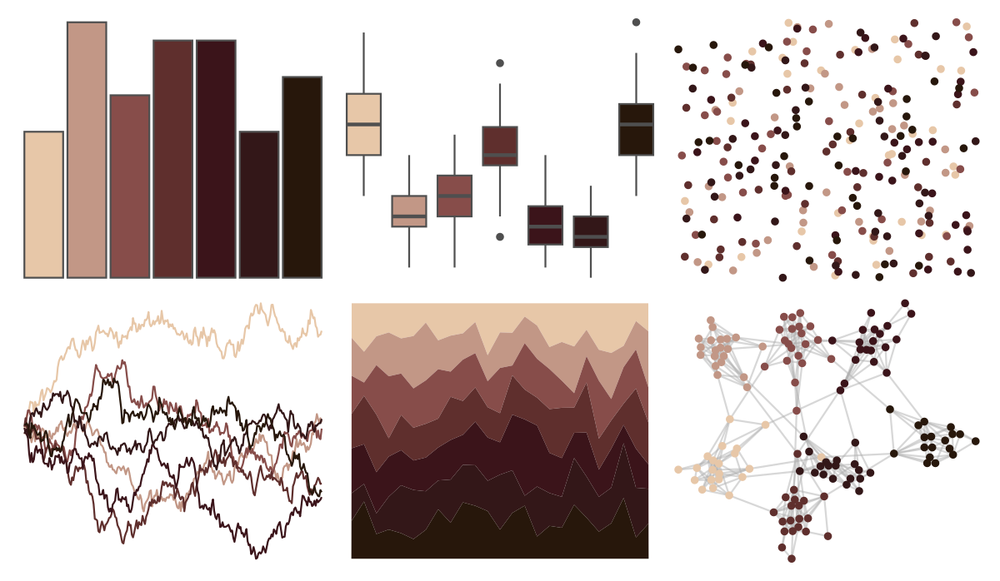

# MexBrewer - Aurora 

::: columns
::: {.column width="50%"}

**Github**

[paezha/MexBrewer](https://github.com/paezha/MexBrewer)
:::

::: {.column width="50%"}

**CRAN**

Not on CRAN
:::
:::

<hr> 

Use with [paletteer](https://emilhvitfeldt.github.io/paletteer/) package:

```r
library(paletteer)
paletteer_d("MexBrewer::Aurora")
```

Use raw:

```r
c("#E7C7A8FF", "#C29786FF", "#874D4AFF", "#5F2F2DFF", "#3B141AFF", "#331718FF", "#27170BFF")
``` 

 

<br>

# Related Palettes

<div class="list" style="display: grid; grid-template-columns: auto auto auto;"> <figure class="figure">
<a href="../../awtools/a_palette/"> </a>
</figure> <figure class="figure">
<a href="../../ButterflyColors/hamadryas_feronia/"> </a>
</figure> <figure class="figure">
<a href="../../ButterflyColors/hamadryas_feronia/"> </a>
</figure> <figure class="figure">
<a href="../../beyonce/X67/"> </a>
</figure> <figure class="figure">
<a href="../../colRoz/kimberley/"> </a>
</figure> <figure class="figure">
<a href="../../lisa/BarnettNewman/"> </a>
</figure> <figure class="figure">
<a href="../../ButterflyColors/heliconius_erato_phyllis/"> </a>
</figure> <figure class="figure">
<a href="../../NineteenEightyR/sunset2/"> </a>
</figure> <figure class="figure">
<a href="../../beyonce/X103/"> </a>
</figure> <figure class="figure">
<a href="../../werpals/firefly/"> </a>
</figure> <figure class="figure">
<a href="../../dutchmasters/anatomy/"> </a>
</figure> <figure class="figure">
<a href="../../lisa/DiegoVelazquez/"> </a>
</figure> 
</div>
