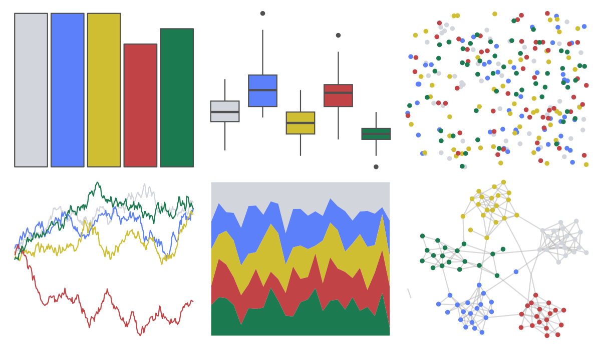

# MexBrewer - Casita1 

::: columns
::: {.column width="50%"}

**Github**

[paezha/MexBrewer](https://github.com/paezha/MexBrewer)
:::

::: {.column width="50%"}

**CRAN**

Not on CRAN
:::
:::

<hr> 

Use with [paletteer](https://emilhvitfeldt.github.io/paletteer/) package:

```r
library(paletteer)
paletteer_d("MexBrewer::Casita1")
```

Use raw:

```r
c("#D2D5DBFF", "#5C80FAFF", "#CFBE31FF", "#C14345FF", "#1B7A4FFF")
``` 

 

<br>

# Related Palettes

<div class="list" style="display: grid; grid-template-columns: auto auto auto;"> <figure class="figure">
<a href="../../awtools/a_palette/"> </a>
</figure> <figure class="figure">
<a href="../../ButterflyColors/hamadryas_feronia/"> </a>
</figure> <figure class="figure">
<a href="../../ButterflyColors/hamadryas_feronia/"> </a>
</figure> <figure class="figure">
<a href="../../PrettyCols/Joyful/"> </a>
</figure> <figure class="figure">
<a href="../../khroma/bright/"> </a>
</figure> <figure class="figure">
<a href="../../tayloRswift/lover/"> </a>
</figure> <figure class="figure">
<a href="../../beyonce/X127/"> </a>
</figure> <figure class="figure">
<a href="../../MoMAColors/Smith/"> </a>
</figure> <figure class="figure">
<a href="../../lisa/MarcChagall/"> </a>
</figure> <figure class="figure">
<a href="../../calecopal/superbloom1/"> </a>
</figure> <figure class="figure">
<a href="../../lisa/ClaesOldenburg/"> </a>
</figure> <figure class="figure">
<a href="../../rtist/oldenburg/"> </a>
</figure> 
</div>
