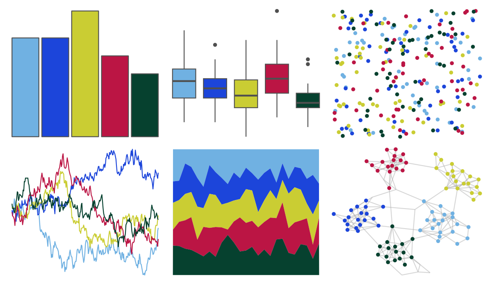

# MexBrewer - Casita2 

::: columns
::: {.column width="50%"}

**Github**

[paezha/MexBrewer](https://github.com/paezha/MexBrewer)
:::

::: {.column width="50%"}

**CRAN**

Not on CRAN
:::
:::

<hr> 

Use with [paletteer](https://emilhvitfeldt.github.io/paletteer/) package:

```r
library(paletteer)
paletteer_d("MexBrewer::Casita2")
```

Use raw:

```r
c("#70B1E2FF", "#1C45DAFF", "#CACD33FF", "#BB1544FF", "#06412FFF")
``` 

 

<br>

# Related Palettes

<div class="list" style="display: grid; grid-template-columns: auto auto auto;"> <figure class="figure">
<a href="../../amerika/Dem_Ind_Rep3/"> </a>
</figure> <figure class="figure">
<a href="../../fishualize/Paracanthurus_hepatus/"> </a>
</figure> <figure class="figure">
<a href="../../lisa/RoyLichtenstein/"> </a>
</figure> <figure class="figure">
<a href="../../fishualize/Cephalopholis_argus/"> </a>
</figure> <figure class="figure">
<a href="../../fishualize/Acanthurus_sohal/"> </a>
</figure> <figure class="figure">
<a href="../../beyonce/X18/"> </a>
</figure> <figure class="figure">
<a href="../../khroma/mediumcontrast/"> </a>
</figure> <figure class="figure">
<a href="../../LaCroixColoR/PassionFruit/"> </a>
</figure> <figure class="figure">
<a href="../../MoMAColors/Fritsch/"> </a>
</figure> <figure class="figure">
<a href="../../RSkittleBrewer/wildberry/"> </a>
</figure> <figure class="figure">
<a href="../../MoMAColors/Andri/"> </a>
</figure> <figure class="figure">
<a href="../../khroma/muted/"> </a>
</figure> 
</div>
