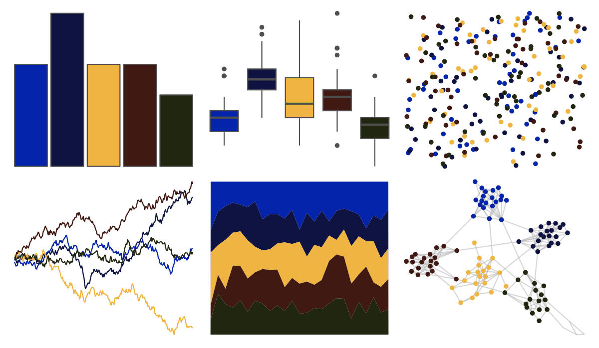

# MexBrewer - Casita3 

::: columns
::: {.column width="50%"}

**Github**

[paezha/MexBrewer](https://github.com/paezha/MexBrewer)
:::

::: {.column width="50%"}

**CRAN**

Not on CRAN
:::
:::

<hr> 

Use with [paletteer](https://emilhvitfeldt.github.io/paletteer/) package:

```r
library(paletteer)
paletteer_d("MexBrewer::Casita3")
```

Use raw:

```r
c("#0424ACFF", "#0F1342FF", "#EFB540FF", "#411913FF", "#202610FF")
``` 

 

<br>

# Related Palettes

<div class="list" style="display: grid; grid-template-columns: auto auto auto;"> <figure class="figure">
<a href="../../awtools/a_palette/"> </a>
</figure> <figure class="figure">
<a href="../../ButterflyColors/hamadryas_feronia/"> </a>
</figure> <figure class="figure">
<a href="../../ButterflyColors/hamadryas_feronia/"> </a>
</figure> <figure class="figure">
<a href="../../nbapalettes/nuggets_statement/"> </a>
</figure> <figure class="figure">
<a href="../../nbapalettes/pacers_venue/"> </a>
</figure> <figure class="figure">
<a href="../../ggprism/summer/"> </a>
</figure> <figure class="figure">
<a href="../../nbapalettes/bucks_city/"> </a>
</figure> <figure class="figure">
<a href="../../PrettyCols/Dark/"> </a>
</figure> <figure class="figure">
<a href="../../ochRe/nolan_ned/"> </a>
</figure> <figure class="figure">
<a href="../../nbapalettes/suns_00s/"> </a>
</figure> <figure class="figure">
<a href="../../nbapalettes/mavericks_alt/"> </a>
</figure> <figure class="figure">
<a href="../../wesanderson/BottleRocket2/"> </a>
</figure> 
</div>
