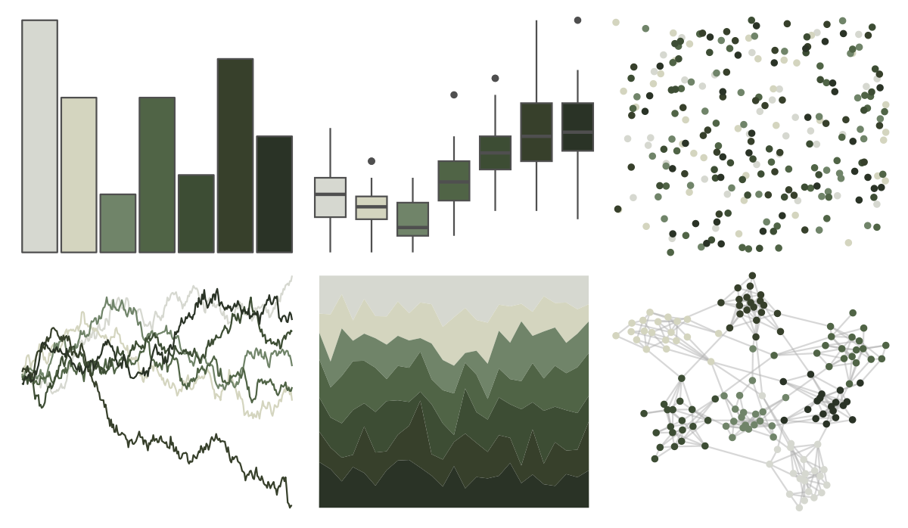

# MexBrewer - Concha 

::: columns
::: {.column width="50%"}

**Github**

[paezha/MexBrewer](https://github.com/paezha/MexBrewer)
:::

::: {.column width="50%"}

**CRAN**

Not on CRAN
:::
:::

<hr> 

Use with [paletteer](https://emilhvitfeldt.github.io/paletteer/) package:

```r
library(paletteer)
paletteer_d("MexBrewer::Concha")
```

Use raw:

```r
c("#D6D8D0FF", "#D4D5BFFF", "#708469FF", "#506446FF", "#3D4D34FF", "#37402BFF", "#2A3326FF")
``` 

 

<br>

# Related Palettes

<div class="list" style="display: grid; grid-template-columns: auto auto auto;"> <figure class="figure">
<a href="../../awtools/a_palette/"> </a>
</figure> <figure class="figure">
<a href="../../ButterflyColors/hamadryas_feronia/"> </a>
</figure> <figure class="figure">
<a href="../../ButterflyColors/hamadryas_feronia/"> </a>
</figure> <figure class="figure">
<a href="../../ButterflyColors/dynamine_postverta/"> </a>
</figure> <figure class="figure">
<a href="../../fishualize/Lile_piquitinga/"> </a>
</figure> <figure class="figure">
<a href="../../calecopal/chaparral3/"> </a>
</figure> <figure class="figure">
<a href="../../calecopal/creek/"> </a>
</figure> <figure class="figure">
<a href="../../lisa/Pierre_AugusteRenoir_1/"> </a>
</figure> <figure class="figure">
<a href="../../ochRe/winmar/"> </a>
</figure> <figure class="figure">
<a href="../../MetBrewer/VanGogh3/"> </a>
</figure> <figure class="figure">
<a href="../../tayloRswift/midnightsMahogany/"> </a>
</figure> <figure class="figure">
<a href="../../colRoz/shark_bay/"> </a>
</figure> 
</div>
