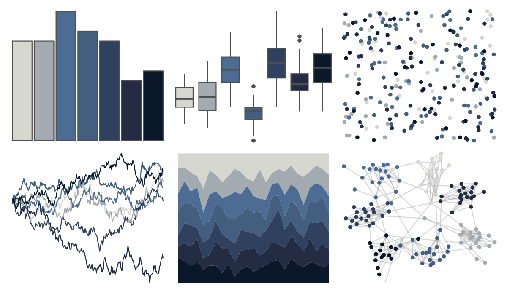

# MexBrewer - Frida 

::: columns
::: {.column width="50%"}

**Github**

[paezha/MexBrewer](https://github.com/paezha/MexBrewer)
:::

::: {.column width="50%"}

**CRAN**

Not on CRAN
:::
:::

<hr> 

Use with [paletteer](https://emilhvitfeldt.github.io/paletteer/) package:

```r
library(paletteer)
paletteer_d("MexBrewer::Frida")
```

Use raw:

```r
c("#D6D8D0FF", "#A4ABB0FF", "#4C6C94FF", "#435E7FFF", "#2F415FFF", "#232C43FF", "#0B1829FF")
``` 

 

<br>

# Related Palettes

<div class="list" style="display: grid; grid-template-columns: auto auto auto;"> <figure class="figure">
<a href="../../amerika/Dem_Ind_Rep3/"> </a>
</figure> <figure class="figure">
<a href="../../nord/mountain_forms/"> </a>
</figure> <figure class="figure">
<a href="../../lisa/GeorgiaOKeeffe/"> </a>
</figure> <figure class="figure">
<a href="../../rtist/okeeffe/"> </a>
</figure> <figure class="figure">
<a href="../../severance/Dinner/"> </a>
</figure> <figure class="figure">
<a href="../../musculusColors/ErHead/"> </a>
</figure> <figure class="figure">
<a href="../../beyonce/X7/"> </a>
</figure> <figure class="figure">
<a href="../../beyonce/X125/"> </a>
</figure> <figure class="figure">
<a href="../../trekcolors/andorian/"> </a>
</figure> <figure class="figure">
<a href="../../beyonce/X47/"> </a>
</figure> <figure class="figure">
<a href="../../beyonce/X77/"> </a>
</figure> <figure class="figure">
<a href="../../MexBrewer/Maiz/"> </a>
</figure> 
</div>
