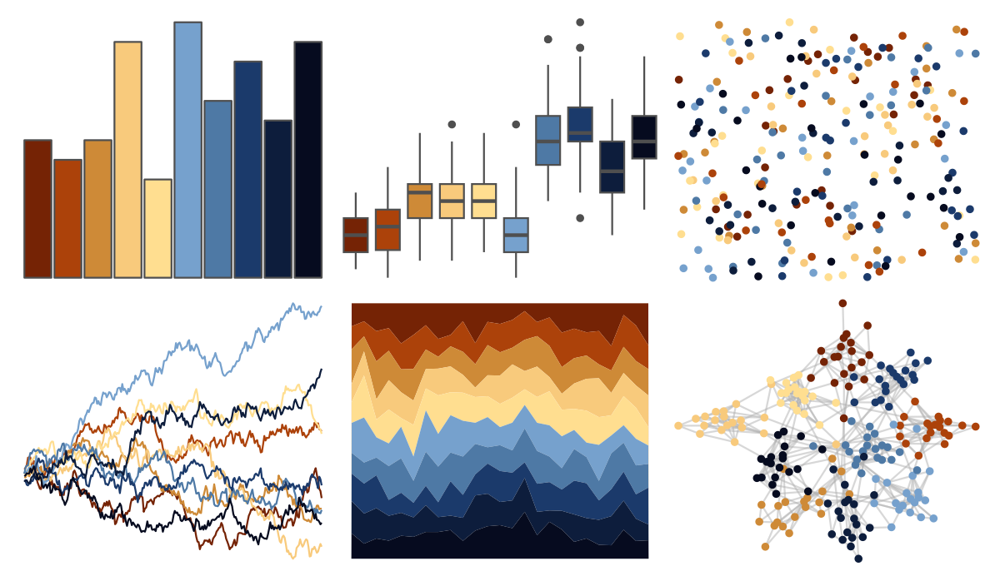
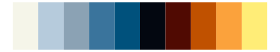
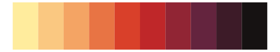

# MexBrewer - Huida 

::: columns
::: {.column width="50%"}

**Github**

[paezha/MexBrewer](https://github.com/paezha/MexBrewer)
:::

::: {.column width="50%"}

**CRAN**

Not on CRAN
:::
:::

<hr> 

Use with [paletteer](https://emilhvitfeldt.github.io/paletteer/) package:

```r
library(paletteer)
paletteer_d("MexBrewer::Huida")
```

Use raw:

```r
c("#752305FF", "#AC420AFF", "#CE8A37FF", "#F8CA7CFF", "#FFDE90FF", "#76A1CDFF", "#4E79A5FF", "#1B3A6BFF", "#0D1D3CFF", "#060B1FFF")
``` 

 

<br>

# Related Palettes

<div class="list" style="display: grid; grid-template-columns: auto auto auto;"> <figure class="figure">
<a href="../../amerika/Dem_Ind_Rep3/"> </a>
</figure> <figure class="figure">
<a href="../../peRReo/badbunny2/"> </a>
</figure> <figure class="figure">
<a href="../../werpals/benagil/"> </a>
</figure> <figure class="figure">
<a href="../../tvthemes/Steven/"> </a>
</figure> <figure class="figure">
<a href="../../ltc/heatmap/"> </a>
</figure> <figure class="figure">
<a href="../../MetBrewer/Renoir/"> </a>
</figure> <figure class="figure">
<a href="../../werpals/uyuni/"> </a>
</figure> <figure class="figure">
<a href="../../tvthemes/Sunstone/"> </a>
</figure> <figure class="figure">
<a href="../../MoMAColors/Exter/"> </a>
</figure> <figure class="figure">
<a href="../../nationalparkcolors/GeneralGrant/"> </a>
</figure> <figure class="figure">
<a href="../../MoMAColors/Klein/"> </a>
</figure> <figure class="figure">
<a href="../../tvthemes/CrazyLaceAgate/"> </a>
</figure> 
</div>
