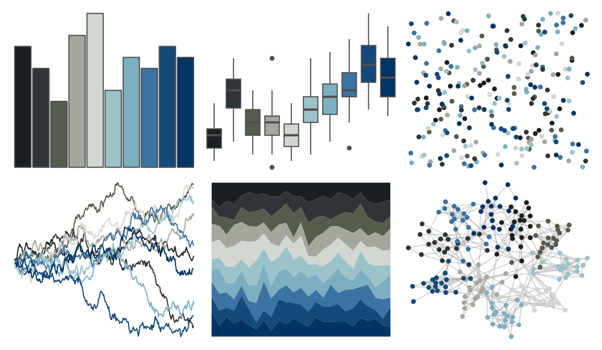

# MexBrewer - Maiz 

::: columns
::: {.column width="50%"}

**Github**

[paezha/MexBrewer](https://github.com/paezha/MexBrewer)
:::

::: {.column width="50%"}

**CRAN**

Not on CRAN
:::
:::

<hr> 

Use with [paletteer](https://emilhvitfeldt.github.io/paletteer/) package:

```r
library(paletteer)
paletteer_d("MexBrewer::Maiz")
```

Use raw:

```r
c("#1A2021FF", "#2F3536FF", "#555C4EFF", "#A5A79EFF", "#D2D7D1FF", "#9BC3C9FF", "#7CB0C1FF", "#3D72A2FF", "#144979FF", "#003464FF")
``` 

 

<br>

# Related Palettes

<div class="list" style="display: grid; grid-template-columns: auto auto auto;"> <figure class="figure">
<a href="../../awtools/a_palette/"> </a>
</figure> <figure class="figure">
<a href="../../ButterflyColors/hamadryas_feronia/"> </a>
</figure> <figure class="figure">
<a href="../../ButterflyColors/hamadryas_feronia/"> </a>
</figure> <figure class="figure">
<a href="../../miscpalettes/waterfall/"> </a>
</figure> <figure class="figure">
<a href="../../beyonce/X77/"> </a>
</figure> <figure class="figure">
<a href="../../ghibli/SpiritedMedium/"> </a>
</figure> <figure class="figure">
<a href="../../palettetown/dragonair/"> </a>
</figure> <figure class="figure">
<a href="../../ghibli/LaputaMedium/"> </a>
</figure> <figure class="figure">
<a href="../../Redmonder/dPBIPuGn/"> </a>
</figure> <figure class="figure">
<a href="../../nbapalettes/hornets_city2/"> </a>
</figure> <figure class="figure">
<a href="../../beyonce/X64/"> </a>
</figure> <figure class="figure">
<a href="../../MexBrewer/Frida/"> </a>
</figure> 
</div>
