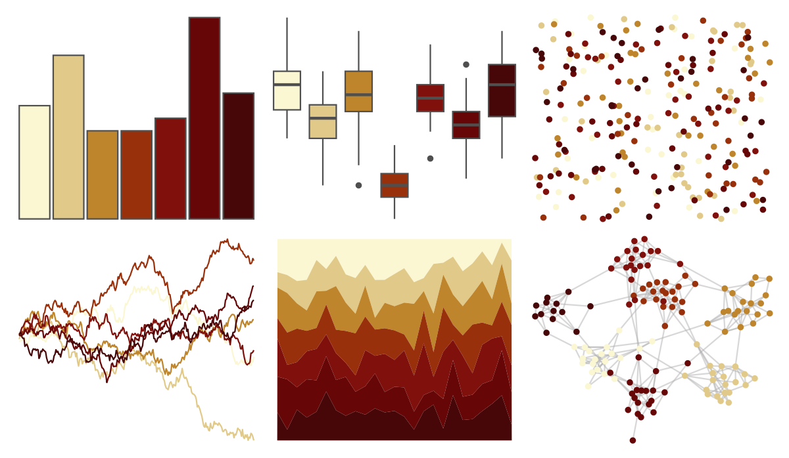

# MexBrewer - Naturaleza 

::: columns
::: {.column width="50%"}

**Github**

[paezha/MexBrewer](https://github.com/paezha/MexBrewer)
:::

::: {.column width="50%"}

**CRAN**

Not on CRAN
:::
:::

<hr> 

Use with [paletteer](https://emilhvitfeldt.github.io/paletteer/) package:

```r
library(paletteer)
paletteer_d("MexBrewer::Naturaleza")
```

Use raw:

```r
c("#FAF7D2FF", "#E1CA89FF", "#BE852CFF", "#99300CFF", "#80100CFF", "#660607FF", "#470607FF")
``` 

 

<br>

# Related Palettes

<div class="list" style="display: grid; grid-template-columns: auto auto auto;"> <figure class="figure">
<a href="../../awtools/a_palette/"> </a>
</figure> <figure class="figure">
<a href="../../ButterflyColors/hamadryas_feronia/"> </a>
</figure> <figure class="figure">
<a href="../../ButterflyColors/hamadryas_feronia/"> </a>
</figure> <figure class="figure">
<a href="../../colRoz/a_ramsayi/"> </a>
</figure> <figure class="figure">
<a href="../../soilpalettes/podzol/"> </a>
</figure> <figure class="figure">
<a href="../../soilpalettes/durorthod/"> </a>
</figure> <figure class="figure">
<a href="../../beyonce/X45/"> </a>
</figure> <figure class="figure">
<a href="../../beyonce/X16/"> </a>
</figure> <figure class="figure">
<a href="../../colRoz/a_plagiata/"> </a>
</figure> <figure class="figure">
<a href="../../soilpalettes/natrudoll/"> </a>
</figure> <figure class="figure">
<a href="../../fishualize/Parablennius_marmoreus/"> </a>
</figure> <figure class="figure">
<a href="../../beyonce/X36/"> </a>
</figure> 
</div>
