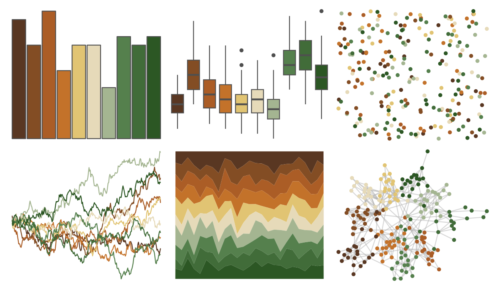

# MexBrewer - Ofrenda 

::: columns
::: {.column width="50%"}

**Github**

[paezha/MexBrewer](https://github.com/paezha/MexBrewer)
:::

::: {.column width="50%"}

**CRAN**

Not on CRAN
:::
:::

<hr> 

Use with [paletteer](https://emilhvitfeldt.github.io/paletteer/) package:

```r
library(paletteer)
paletteer_d("MexBrewer::Ofrenda")
```

Use raw:

```r
c("#593722FF", "#834D24FF", "#AB5D26FF", "#C3722AFF", "#E1C473FF", "#E6DAB9FF", "#A4B591FF", "#55804DFF", "#416C39FF", "#2C5724FF")
``` 

 

<br>

# Related Palettes

<div class="list" style="display: grid; grid-template-columns: auto auto auto;"> <figure class="figure">
<a href="../../awtools/a_palette/"> </a>
</figure> <figure class="figure">
<a href="../../ButterflyColors/hamadryas_feronia/"> </a>
</figure> <figure class="figure">
<a href="../../ButterflyColors/hamadryas_feronia/"> </a>
</figure> <figure class="figure">
<a href="../../IslamicArt/fes/"> </a>
</figure> <figure class="figure">
<a href="../../impressionist.colors/paysage_tropical_avec_masureset_palmiers/"> </a>
</figure> <figure class="figure">
<a href="../../rcartocolor/Fall/"> </a>
</figure> <figure class="figure">
<a href="../../impressionist.colors/danseuses_a_la_barre/"> </a>
</figure> <figure class="figure">
<a href="../../calecopal/oak/"> </a>
</figure> <figure class="figure">
<a href="../../MetBrewer/Paquin/"> </a>
</figure> <figure class="figure">
<a href="../../nord/moose_pond/"> </a>
</figure> <figure class="figure">
<a href="../../NatParksPalettes/Olympic/"> </a>
</figure> <figure class="figure">
<a href="../../fishualize/Zapteryx_brevirostris/"> </a>
</figure> 
</div>
