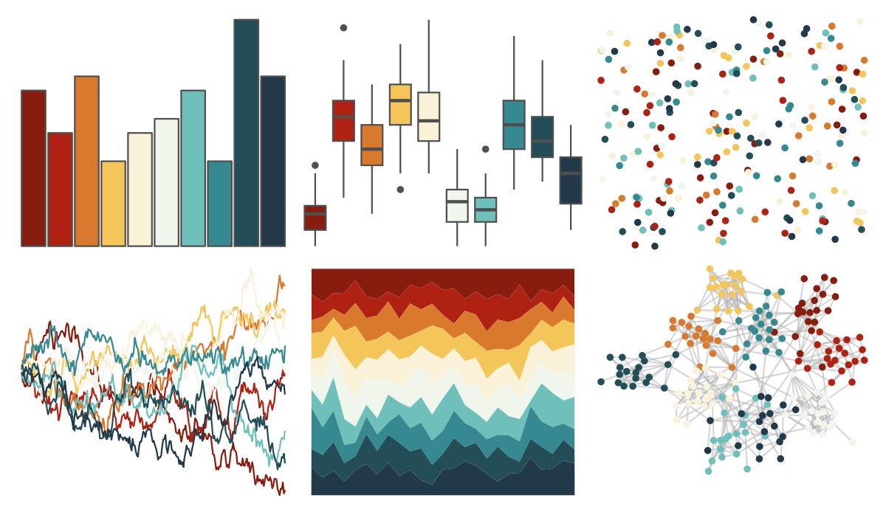

# MexBrewer - Revolucion 

::: columns
::: {.column width="50%"}

**Github**

[paezha/MexBrewer](https://github.com/paezha/MexBrewer)
:::

::: {.column width="50%"}

**CRAN**

Not on CRAN
:::
:::

<hr> 

Use with [paletteer](https://emilhvitfeldt.github.io/paletteer/) package:

```r
library(paletteer)
paletteer_d("MexBrewer::Revolucion")
```

Use raw:

```r
c("#871C0FFF", "#AF2213FF", "#D9792EFF", "#F4C659FF", "#F9F2D8FF", "#F0F6EBFF", "#6FC0BAFF", "#368990FF", "#244E57FF", "#22394AFF")
``` 

 

<br>

# Related Palettes

<div class="list" style="display: grid; grid-template-columns: auto auto auto;"> <figure class="figure">
<a href="../../awtools/a_palette/"> </a>
</figure> <figure class="figure">
<a href="../../ButterflyColors/hamadryas_feronia/"> </a>
</figure> <figure class="figure">
<a href="../../ButterflyColors/hamadryas_feronia/"> </a>
</figure> <figure class="figure">
<a href="../../MetBrewer/Hiroshige/"> </a>
</figure> <figure class="figure">
<a href="../../palettetown/totodile/"> </a>
</figure> <figure class="figure">
<a href="../../PrettyCols/TangerineBlues/"> </a>
</figure> <figure class="figure">
<a href="../../beyonce/X75/"> </a>
</figure> <figure class="figure">
<a href="../../palettetown/swampert/"> </a>
</figure> <figure class="figure">
<a href="../../miscpalettes/dreaming/"> </a>
</figure> <figure class="figure">
<a href="../../Redmonder/qMSO12/"> </a>
</figure> <figure class="figure">
<a href="../../khroma/sunset/"> </a>
</figure> <figure class="figure">
<a href="../../werpals/benagil/"> </a>
</figure> 
</div>
