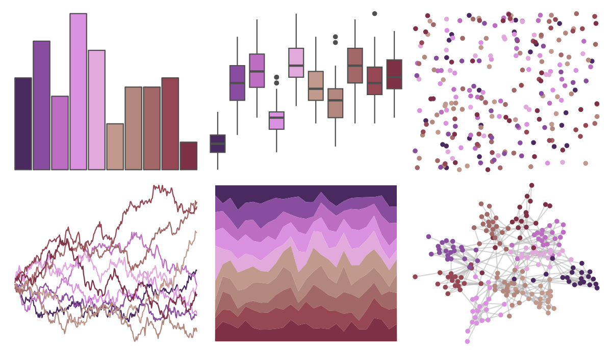

# MexBrewer - Ronda 

::: columns
::: {.column width="50%"}

**Github**

[paezha/MexBrewer](https://github.com/paezha/MexBrewer)
:::

::: {.column width="50%"}

**CRAN**

Not on CRAN
:::
:::

<hr> 

Use with [paletteer](https://emilhvitfeldt.github.io/paletteer/) package:

```r
library(paletteer)
paletteer_d("MexBrewer::Ronda")
```

Use raw:

```r
c("#49295FFF", "#894D9FFF", "#BD6DC2FF", "#DA91E0FF", "#E2A9DCFF", "#C19A8DFF", "#B2877DFF", "#A26867FF", "#964754FF", "#7E3146FF")
``` 

 

<br>

# Related Palettes

<div class="list" style="display: grid; grid-template-columns: auto auto auto;"> <figure class="figure">
<a href="../../awtools/a_palette/"> </a>
</figure> <figure class="figure">
<a href="../../ButterflyColors/hamadryas_feronia/"> </a>
</figure> <figure class="figure">
<a href="../../ButterflyColors/hamadryas_feronia/"> </a>
</figure> <figure class="figure">
<a href="../../rcartocolor/PurpOr/"> </a>
</figure> <figure class="figure">
<a href="../../rcartocolor/Magenta/"> </a>
</figure> <figure class="figure">
<a href="../../beyonce/X41/"> </a>
</figure> <figure class="figure">
<a href="../../tvthemes/Dusk/"> </a>
</figure> <figure class="figure">
<a href="../../NatParksPalettes/Arches2/"> </a>
</figure> <figure class="figure">
<a href="../../ltc/franscoise/"> </a>
</figure> <figure class="figure">
<a href="../../trekcolors/lcars_2375/"> </a>
</figure> <figure class="figure">
<a href="../../Redmonder/sPBIRdPu/"> </a>
</figure> <figure class="figure">
<a href="../../rockthemes/muse/"> </a>
</figure> 
</div>
