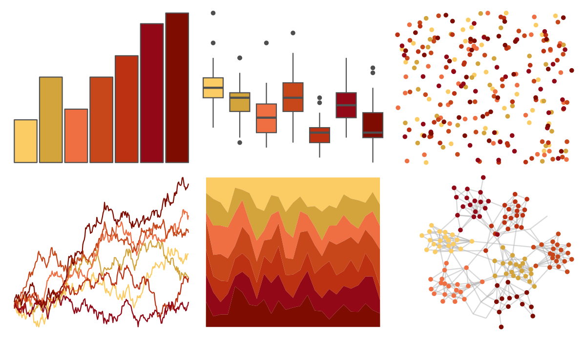

# MexBrewer - Taurus1 

::: columns
::: {.column width="50%"}

**Github**

[paezha/MexBrewer](https://github.com/paezha/MexBrewer)
:::

::: {.column width="50%"}

**CRAN**

Not on CRAN
:::
:::

<hr> 

Use with [paletteer](https://emilhvitfeldt.github.io/paletteer/) package:

```r
library(paletteer)
paletteer_d("MexBrewer::Taurus1")
```

Use raw:

```r
c("#FCCC64FF", "#D4A43CFF", "#EF6F43FF", "#C7471BFF", "#BC3112FF", "#930816FF", "#7E0C01FF")
``` 

 

<br>

# Related Palettes

<div class="list" style="display: grid; grid-template-columns: auto auto auto;"> <figure class="figure">
<a href="../../awtools/a_palette/"> </a>
</figure> <figure class="figure">
<a href="../../ButterflyColors/hamadryas_feronia/"> </a>
</figure> <figure class="figure">
<a href="../../ButterflyColors/hamadryas_feronia/"> </a>
</figure> <figure class="figure">
<a href="../../nbapalettes/nuggets_city/"> </a>
</figure> <figure class="figure">
<a href="../../MetBrewer/Greek/"> </a>
</figure> <figure class="figure">
<a href="../../MetBrewer/Peru2/"> </a>
</figure> <figure class="figure">
<a href="../../ggthemes/excel_Red_Orange/"> </a>
</figure> <figure class="figure">
<a href="../../fishualize/Dermatolepis_inermis/"> </a>
</figure> <figure class="figure">
<a href="../../wesanderson/GrandBudapest1/"> </a>
</figure> <figure class="figure">
<a href="../../rockthemes/alice/"> </a>
</figure> <figure class="figure">
<a href="../../yarrr/rat/"> </a>
</figure> <figure class="figure">
<a href="../../ggprism/beer_and_ales/"> </a>
</figure> 
</div>
