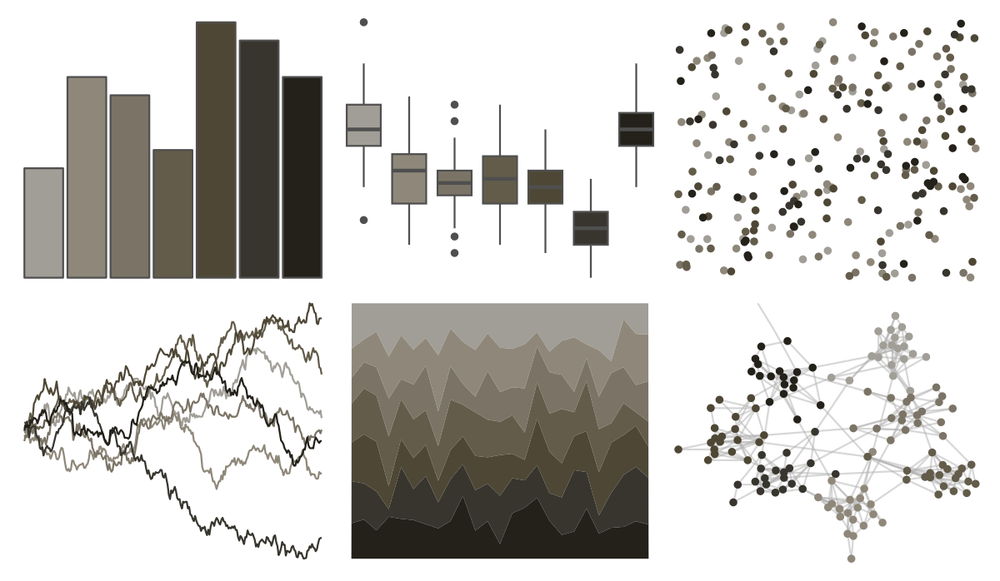

# MexBrewer - Taurus2 

::: columns
::: {.column width="50%"}

**Github**

[paezha/MexBrewer](https://github.com/paezha/MexBrewer)
:::

::: {.column width="50%"}

**CRAN**

Not on CRAN
:::
:::

<hr> 

Use with [paletteer](https://emilhvitfeldt.github.io/paletteer/) package:

```r
library(paletteer)
paletteer_d("MexBrewer::Taurus2")
```

Use raw:

```r
c("#A19E97FF", "#8F887AFF", "#7B7466FF", "#635C4AFF", "#4E4735FF", "#37352EFF", "#23211AFF")
``` 

 

<br>

# Related Palettes

<div class="list" style="display: grid; grid-template-columns: auto auto auto;"> <figure class="figure">
<a href="../../awtools/a_palette/"> </a>
</figure> <figure class="figure">
<a href="../../ButterflyColors/hamadryas_feronia/"> </a>
</figure> <figure class="figure">
<a href="../../ButterflyColors/hamadryas_feronia/"> </a>
</figure> <figure class="figure">
<a href="../../beyonce/X3/"> </a>
</figure> <figure class="figure">
<a href="../../ButterflyColors/dynamine_postverta/"> </a>
</figure> <figure class="figure">
<a href="../../colRoz/thylacine/"> </a>
</figure> <figure class="figure">
<a href="../../lisa/DiegoVelazquez/"> </a>
</figure> <figure class="figure">
<a href="../../lisa/C_M_Coolidge/"> </a>
</figure> <figure class="figure">
<a href="../../beyonce/X103/"> </a>
</figure> <figure class="figure">
<a href="../../fishualize/Petromyzon_marinus/"> </a>
</figure> <figure class="figure">
<a href="../../fishualize/Lile_piquitinga/"> </a>
</figure> <figure class="figure">
<a href="../../colRoz/v_viatica/"> </a>
</figure> 
</div>
