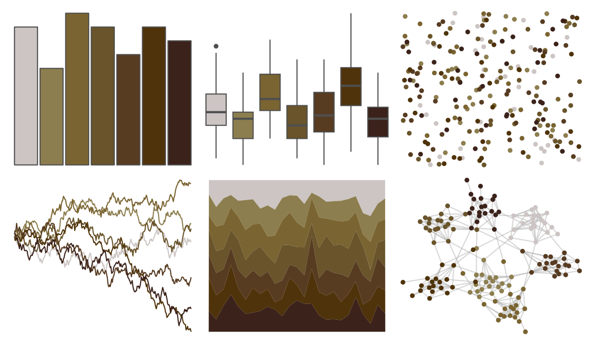

# MexBrewer - Tierra 

::: columns
::: {.column width="50%"}

**Github**

[paezha/MexBrewer](https://github.com/paezha/MexBrewer)
:::

::: {.column width="50%"}

**CRAN**

Not on CRAN
:::
:::

<hr> 

Use with [paletteer](https://emilhvitfeldt.github.io/paletteer/) package:

```r
library(paletteer)
paletteer_d("MexBrewer::Tierra")
```

Use raw:

```r
c("#CCC5C3FF", "#8D7E4FFF", "#7A6431FF", "#69542BFF", "#573C22FF", "#4F330AFF", "#3B221AFF")
``` 

 

<br>

# Related Palettes

<div class="list" style="display: grid; grid-template-columns: auto auto auto;"> <figure class="figure">
<a href="../../awtools/a_palette/"> </a>
</figure> <figure class="figure">
<a href="../../ButterflyColors/hamadryas_feronia/"> </a>
</figure> <figure class="figure">
<a href="../../ButterflyColors/hamadryas_feronia/"> </a>
</figure> <figure class="figure">
<a href="../../colRoz/desert_flood/"> </a>
</figure> <figure class="figure">
<a href="../../colRoz/p_breviceps/"> </a>
</figure> <figure class="figure">
<a href="../../lisa/DiegoVelazquez/"> </a>
</figure> <figure class="figure">
<a href="../../beyonce/X103/"> </a>
</figure> <figure class="figure">
<a href="../../tayloRswift/taylorRed/"> </a>
</figure> <figure class="figure">
<a href="../../colRoz/e_kingii/"> </a>
</figure> <figure class="figure">
<a href="../../lisa/BarnettNewman/"> </a>
</figure> <figure class="figure">
<a href="../../trekcolors/terran/"> </a>
</figure> <figure class="figure">
<a href="../../lisa/MiltonAvery/"> </a>
</figure> 
</div>
