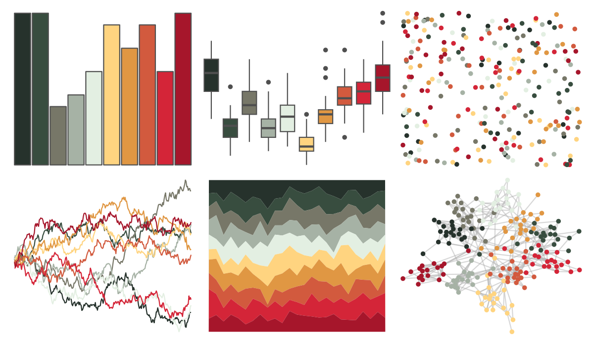

# MexBrewer - Vendedora 

::: columns
::: {.column width="50%"}

**Github**

[paezha/MexBrewer](https://github.com/paezha/MexBrewer)
:::

::: {.column width="50%"}

**CRAN**

Not on CRAN
:::
:::

<hr> 

Use with [paletteer](https://emilhvitfeldt.github.io/paletteer/) package:

```r
library(paletteer)
paletteer_d("MexBrewer::Vendedora")
```

Use raw:

```r
c("#26322CFF", "#384D3FFF", "#777768FF", "#A6B2A5FF", "#E3EFE2FF", "#FFD480FF", "#E09743FF", "#D25A3EFF", "#D42538FF", "#A6162BFF")
``` 

 

<br>

# Related Palettes

<div class="list" style="display: grid; grid-template-columns: auto auto auto;"> <figure class="figure">
<a href="../../amerika/Dem_Ind_Rep3/"> </a>
</figure> <figure class="figure">
<a href="../../palettetown/umbreon/"> </a>
</figure> <figure class="figure">
<a href="../../palettetown/houndoom/"> </a>
</figure> <figure class="figure">
<a href="../../palettetown/houndour/"> </a>
</figure> <figure class="figure">
<a href="../../trekcolors/tholian/"> </a>
</figure> <figure class="figure">
<a href="../../lisa/SandroBotticelli_1/"> </a>
</figure> <figure class="figure">
<a href="../../colRoz/ngadju/"> </a>
</figure> <figure class="figure">
<a href="../../palettetown/hitmonchan/"> </a>
</figure> <figure class="figure">
<a href="../../palettetown/skarmory/"> </a>
</figure> <figure class="figure">
<a href="../../MetBrewer/Paquin/"> </a>
</figure> <figure class="figure">
<a href="../../palettetown/magcargo/"> </a>
</figure> <figure class="figure">
<a href="../../palettetown/sneasel/"> </a>
</figure> 
</div>
