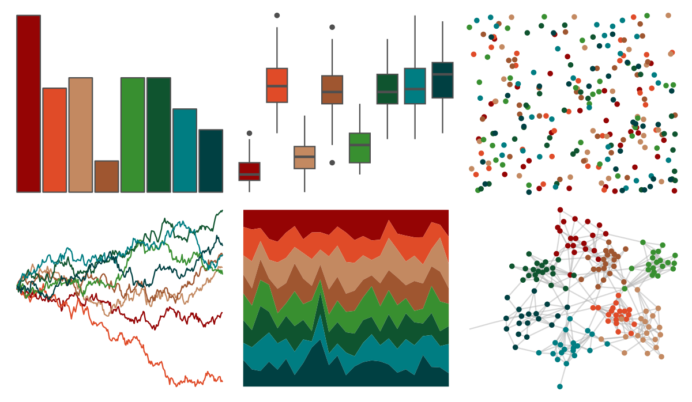
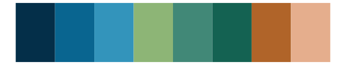

# MoMAColors - Abbott 

::: columns
::: {.column width="50%"}

**Github**

[BlakeRMills/MoMAColors](https://github.com/BlakeRMills/MoMAColors)
:::

::: {.column width="50%"}

**CRAN**

Not on CRAN
:::
:::

<hr> 

Use with [paletteer](https://emilhvitfeldt.github.io/paletteer/) package:

```r
library(paletteer)
paletteer_d("MoMAColors::Abbott")
```

Use raw:

```r
c("#950404FF", "#E04B28FF", "#C38961FF", "#9F5630FF", "#388F30FF", "#0F542FFF", "#007D82FF", "#004042FF")
``` 

 

<br>

# Related Palettes

<div class="list" style="display: grid; grid-template-columns: auto auto auto;"> <figure class="figure">
<a href="../../amerika/Dem_Ind_Rep3/"> </a>
</figure> <figure class="figure">
<a href="../../MetBrewer/Juarez/"> </a>
</figure> <figure class="figure">
<a href="../../MetBrewer/Degas/"> </a>
</figure> <figure class="figure">
<a href="../../werpals/small_world/"> </a>
</figure> <figure class="figure">
<a href="../../MetBrewer/Nattier/"> </a>
</figure> <figure class="figure">
<a href="../../calecopal/kelp1/"> </a>
</figure> <figure class="figure">
<a href="../../vangogh/SunflowersMunich/"> </a>
</figure> <figure class="figure">
<a href="../../Manu/Pohutukawa/"> </a>
</figure> <figure class="figure">
<a href="../../beyonce/X40/"> </a>
</figure> <figure class="figure">
<a href="../../ggprism/muted_rainbow/"> </a>
</figure> <figure class="figure">
<a href="../../peRReo/badbunny2/"> </a>
</figure> <figure class="figure">
<a href="../../MetBrewer/Tiepolo/"> </a>
</figure> 
</div>
