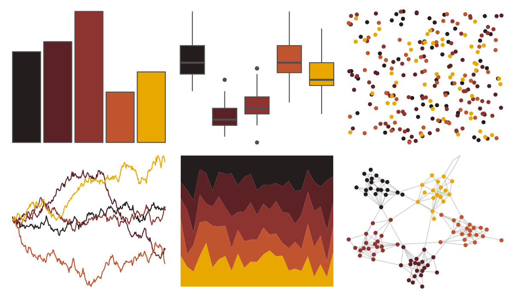

# MoMAColors - Alkalay1 

::: columns
::: {.column width="50%"}

**Github**

[BlakeRMills/MoMAColors](https://github.com/BlakeRMills/MoMAColors)
:::

::: {.column width="50%"}

**CRAN**

Not on CRAN
:::
:::

<hr> 

Use with [paletteer](https://emilhvitfeldt.github.io/paletteer/) package:

```r
library(paletteer)
paletteer_d("MoMAColors::Alkalay1")
```

Use raw:

```r
c("#241D1DFF", "#5B2125FF", "#8D3431FF", "#BF542EFF", "#E9A800FF")
``` 

 

<br>

# Related Palettes

<div class="list" style="display: grid; grid-template-columns: auto auto auto;"> <figure class="figure">
<a href="../../awtools/a_palette/"> </a>
</figure> <figure class="figure">
<a href="../../ButterflyColors/hamadryas_feronia/"> </a>
</figure> <figure class="figure">
<a href="../../ButterflyColors/hamadryas_feronia/"> </a>
</figure> <figure class="figure">
<a href="../../NineteenEightyR/sunset2/"> </a>
</figure> <figure class="figure">
<a href="../../nbapalettes/supersonics_90s/"> </a>
</figure> <figure class="figure">
<a href="../../nbapalettes/heat_dark/"> </a>
</figure> <figure class="figure">
<a href="../../MetBrewer/Nattier/"> </a>
</figure> <figure class="figure">
<a href="../../soilpalettes/paleustalf/"> </a>
</figure> <figure class="figure">
<a href="../../MetBrewer/Gauguin/"> </a>
</figure> <figure class="figure">
<a href="../../ggprism/greenwash/"> </a>
</figure> <figure class="figure">
<a href="../../NineteenEightyR/sunset3/"> </a>
</figure> <figure class="figure">
<a href="../../nbapalettes/jazz_city/"> </a>
</figure> 
</div>
