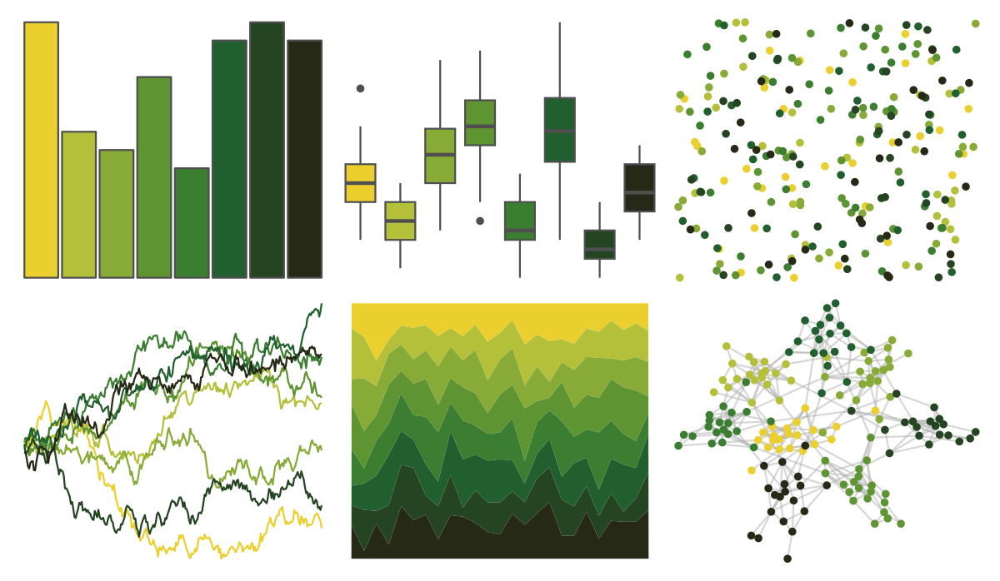

# MoMAColors - Alkalay2 

::: columns
::: {.column width="50%"}

**Github**

[BlakeRMills/MoMAColors](https://github.com/BlakeRMills/MoMAColors)
:::

::: {.column width="50%"}

**CRAN**

Not on CRAN
:::
:::

<hr> 

Use with [paletteer](https://emilhvitfeldt.github.io/paletteer/) package:

```r
library(paletteer)
paletteer_d("MoMAColors::Alkalay2")
```

Use raw:

```r
c("#EBCF2EFF", "#B4BF3AFF", "#88AB38FF", "#5E9432FF", "#3B7D31FF", "#225F2FFF", "#244422FF", "#252916FF")
``` 

 

<br>

# Related Palettes

<div class="list" style="display: grid; grid-template-columns: auto auto auto;"> <figure class="figure">
<a href="../../awtools/a_palette/"> </a>
</figure> <figure class="figure">
<a href="../../ButterflyColors/hamadryas_feronia/"> </a>
</figure> <figure class="figure">
<a href="../../ButterflyColors/hamadryas_feronia/"> </a>
</figure> <figure class="figure">
<a href="../../palettetown/cacturne/"> </a>
</figure> <figure class="figure">
<a href="../../werpals/monet/"> </a>
</figure> <figure class="figure">
<a href="../../fishualize/Gymnothorax_funebris/"> </a>
</figure> <figure class="figure">
<a href="../../colRoz/l_boydii/"> </a>
</figure> <figure class="figure">
<a href="../../MetBrewer/VanGogh3/"> </a>
</figure> <figure class="figure">
<a href="../../tvthemes/Peridot/"> </a>
</figure> <figure class="figure">
<a href="../../fishualize/Elacatinus_figaro/"> </a>
</figure> <figure class="figure">
<a href="../../tvthemes/EarthKingdom/"> </a>
</figure> <figure class="figure">
<a href="../../ghibli/MarnieMedium2/"> </a>
</figure> 
</div>
