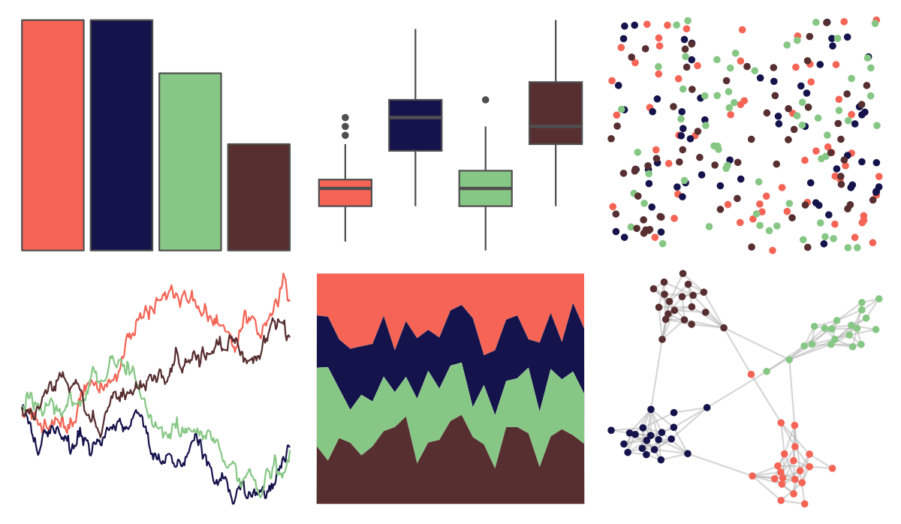

# MoMAColors - Andri 

::: columns
::: {.column width="50%"}

**Github**

[BlakeRMills/MoMAColors](https://github.com/BlakeRMills/MoMAColors)
:::

::: {.column width="50%"}

**CRAN**

Not on CRAN
:::
:::

<hr> 

Use with [paletteer](https://emilhvitfeldt.github.io/paletteer/) package:

```r
library(paletteer)
paletteer_d("MoMAColors::Andri")
```

Use raw:

```r
c("#F56455FF", "#15134BFF", "#87C785FF", "#572F30FF")
``` 

 

<br>

# Related Palettes

<div class="list" style="display: grid; grid-template-columns: auto auto auto;"> <figure class="figure">
<a href="../../amerika/Dem_Ind_Rep3/"> </a>
</figure> <figure class="figure">
<a href="../../IslamicArt/ottoman/"> </a>
</figure> <figure class="figure">
<a href="../../RSkittleBrewer/wildberry/"> </a>
</figure> <figure class="figure">
<a href="../../lisa/HilmaafKlint/"> </a>
</figure> <figure class="figure">
<a href="../../futurevisions/mars/"> </a>
</figure> <figure class="figure">
<a href="../../lisa/PavelTchelitchew/"> </a>
</figure> <figure class="figure">
<a href="../../rockthemes/heep/"> </a>
</figure> <figure class="figure">
<a href="../../MetBrewer/Juarez/"> </a>
</figure> <figure class="figure">
<a href="../../werpals/small_world/"> </a>
</figure> <figure class="figure">
<a href="../../waRhol/bighorn_ram_83/"> </a>
</figure> <figure class="figure">
<a href="../../Manu/Pohutukawa/"> </a>
</figure> <figure class="figure">
<a href="../../NatParksPalettes/Triglav/"> </a>
</figure> 
</div>
