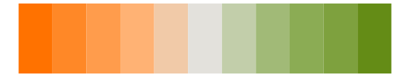
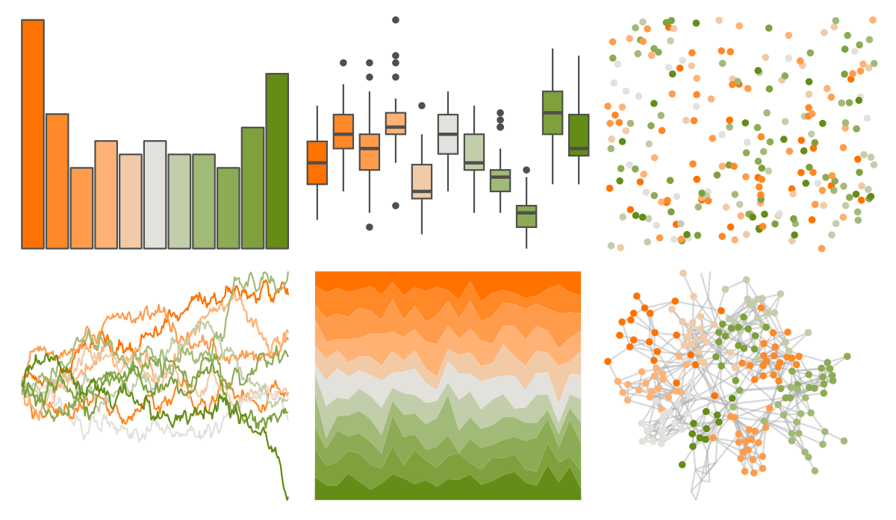
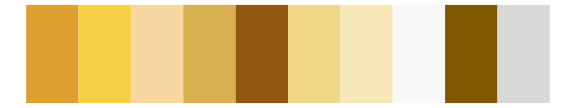

# MoMAColors - Avedon 

::: columns
::: {.column width="50%"}

**Github**

[BlakeRMills/MoMAColors](https://github.com/BlakeRMills/MoMAColors)
:::

::: {.column width="50%"}

**CRAN**

Not on CRAN
:::
:::

<hr> 

Use with [paletteer](https://emilhvitfeldt.github.io/paletteer/) package:

```r
library(paletteer)
paletteer_d("MoMAColors::Avedon")
```

Use raw:

```r
c("#FF7200FF", "#FF8827FF", "#FF9C4CFF", "#FFB274FF", "#F1CAA8FF", "#E3E1DCFF", "#C2CEAAFF", "#A1BA77FF", "#8BAC54FF", "#7EA13EFF", "#648C16FF")
``` 

 

<br>

# Related Palettes

<div class="list" style="display: grid; grid-template-columns: auto auto auto;"> <figure class="figure">
<a href="../../awtools/a_palette/"> </a>
</figure> <figure class="figure">
<a href="../../ButterflyColors/hamadryas_feronia/"> </a>
</figure> <figure class="figure">
<a href="../../ButterflyColors/hamadryas_feronia/"> </a>
</figure> <figure class="figure">
<a href="../../palettetown/psyduck/"> </a>
</figure> <figure class="figure">
<a href="../../palettetown/victreebel/"> </a>
</figure> <figure class="figure">
<a href="../../palettetown/meowth/"> </a>
</figure> <figure class="figure">
<a href="../../palettetown/mankey/"> </a>
</figure> <figure class="figure">
<a href="../../trekcolors/ferengi/"> </a>
</figure> <figure class="figure">
<a href="../../NatParksPalettes/Olympic/"> </a>
</figure> <figure class="figure">
<a href="../../palettetown/weepinbell/"> </a>
</figure> <figure class="figure">
<a href="../../palettetown/kingler/"> </a>
</figure> <figure class="figure">
<a href="../../palettetown/eevee/"> </a>
</figure> 
</div>
