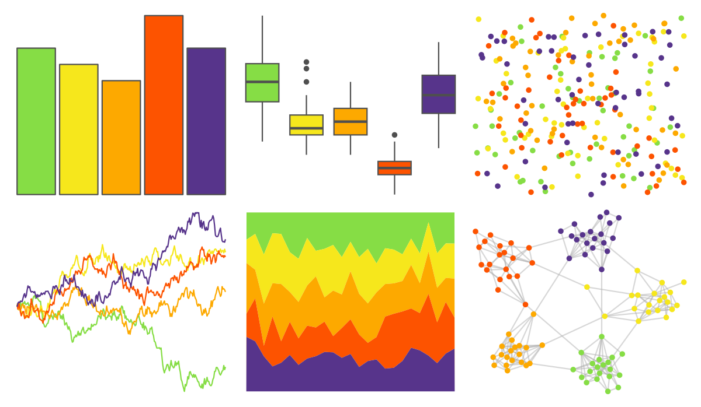

# MoMAColors - Budnitz 

::: columns
::: {.column width="50%"}

**Github**

[BlakeRMills/MoMAColors](https://github.com/BlakeRMills/MoMAColors)
:::

::: {.column width="50%"}

**CRAN**

Not on CRAN
:::
:::

<hr> 

Use with [paletteer](https://emilhvitfeldt.github.io/paletteer/) package:

```r
library(paletteer)
paletteer_d("MoMAColors::Budnitz")
```

Use raw:

```r
c("#86DD45FF", "#F6E71CFF", "#FDA900FF", "#FD5300FF", "#57348BFF")
``` 

 

<br>

# Related Palettes

<div class="list" style="display: grid; grid-template-columns: auto auto auto;"> <figure class="figure">
<a href="../../awtools/a_palette/"> </a>
</figure> <figure class="figure">
<a href="../../ButterflyColors/hamadryas_feronia/"> </a>
</figure> <figure class="figure">
<a href="../../ButterflyColors/hamadryas_feronia/"> </a>
</figure> <figure class="figure">
<a href="../../yarrr/espresso/"> </a>
</figure> <figure class="figure">
<a href="../../RSkittleBrewer/M_M/"> </a>
</figure> <figure class="figure">
<a href="../../LaCroixColoR/PommeBaya/"> </a>
</figure> <figure class="figure">
<a href="../../RSkittleBrewer/original/"> </a>
</figure> <figure class="figure">
<a href="../../lisa/PaulGauguin/"> </a>
</figure> <figure class="figure">
<a href="../../jcolors/pal3/"> </a>
</figure> <figure class="figure">
<a href="../../lisa/BillyApple/"> </a>
</figure> <figure class="figure">
<a href="../../fishualize/Holacanthus_ciliaris/"> </a>
</figure> <figure class="figure">
<a href="../../waRhol/camo_87_1/"> </a>
</figure> 
</div>
