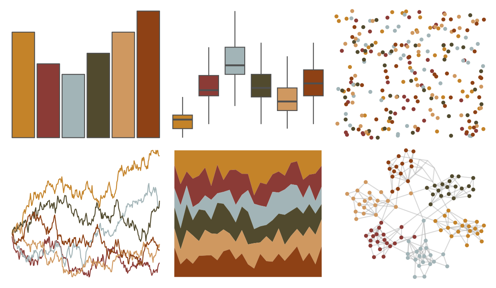

# MoMAColors - Clay 

::: columns
::: {.column width="50%"}

**Github**

[BlakeRMills/MoMAColors](https://github.com/BlakeRMills/MoMAColors)
:::

::: {.column width="50%"}

**CRAN**

Not on CRAN
:::
:::

<hr> 

Use with [paletteer](https://emilhvitfeldt.github.io/paletteer/) package:

```r
library(paletteer)
paletteer_d("MoMAColors::Clay")
```

Use raw:

```r
c("#C48329FF", "#8B3B36FF", "#A2B4B7FF", "#514A2EFF", "#CF9860FF", "#8E4115FF")
``` 

 

<br>

# Related Palettes

<div class="list" style="display: grid; grid-template-columns: auto auto auto;"> <figure class="figure">
<a href="../../awtools/a_palette/"> </a>
</figure> <figure class="figure">
<a href="../../ButterflyColors/hamadryas_feronia/"> </a>
</figure> <figure class="figure">
<a href="../../ButterflyColors/hamadryas_feronia/"> </a>
</figure> <figure class="figure">
<a href="../../ButterflyColors/danaus_eresimus/"> </a>
</figure> <figure class="figure">
<a href="../../severance/Jazz01/"> </a>
</figure> <figure class="figure">
<a href="../../ButterflyColors/synargis_calyce/"> </a>
</figure> <figure class="figure">
<a href="../../ButterflyColors/historis_acheronta/"> </a>
</figure> <figure class="figure">
<a href="../../calecopal/dudleya/"> </a>
</figure> <figure class="figure">
<a href="../../NatParksPalettes/BryceCanyon/"> </a>
</figure> <figure class="figure">
<a href="../../ButterflyColors/stalachtis_phlegia_susanna/"> </a>
</figure> <figure class="figure">
<a href="../../MetBrewer/NewKingdom/"> </a>
</figure> <figure class="figure">
<a href="../../NatParksPalettes/Halekala/"> </a>
</figure> 
</div>
