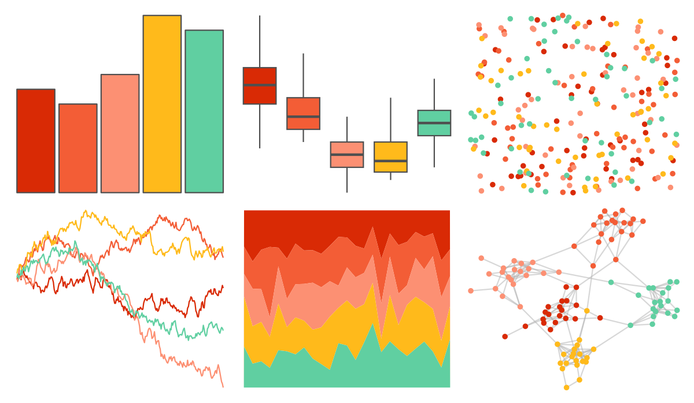

# MoMAColors - Connors 

::: columns
::: {.column width="50%"}

**Github**

[BlakeRMills/MoMAColors](https://github.com/BlakeRMills/MoMAColors)
:::

::: {.column width="50%"}

**CRAN**

Not on CRAN
:::
:::

<hr> 

Use with [paletteer](https://emilhvitfeldt.github.io/paletteer/) package:

```r
library(paletteer)
paletteer_d("MoMAColors::Connors")
```

Use raw:

```r
c("#D92A05FF", "#F35D36FF", "#FC9073FF", "#FFBA1BFF", "#60CFA1FF")
``` 

 

<br>

# Related Palettes

<div class="list" style="display: grid; grid-template-columns: auto auto auto;"> <figure class="figure">
<a href="../../awtools/a_palette/"> </a>
</figure> <figure class="figure">
<a href="../../ButterflyColors/hamadryas_feronia/"> </a>
</figure> <figure class="figure">
<a href="../../ButterflyColors/hamadryas_feronia/"> </a>
</figure> <figure class="figure">
<a href="../../MoMAColors/ustwo/"> </a>
</figure> <figure class="figure">
<a href="../../wesanderson/Darjeeling1/"> </a>
</figure> <figure class="figure">
<a href="../../fishualize/Phractocephalus_hemioliopterus/"> </a>
</figure> <figure class="figure">
<a href="../../RColorBrewer/OrRd/"> </a>
</figure> <figure class="figure">
<a href="../../waRhol/basquiat_85/"> </a>
</figure> <figure class="figure">
<a href="../../fishualize/Trimma_lantana/"> </a>
</figure> <figure class="figure">
<a href="../../wesanderson/FantasticFox1/"> </a>
</figure> <figure class="figure">
<a href="../../DresdenColor/skingame/"> </a>
</figure> <figure class="figure">
<a href="../../PrettyCols/Lucent/"> </a>
</figure> 
</div>
