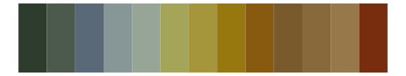

# MoMAColors - Dali 

::: columns
::: {.column width="50%"}

**Github**

[BlakeRMills/MoMAColors](https://github.com/BlakeRMills/MoMAColors)
:::

::: {.column width="50%"}

**CRAN**

Not on CRAN
:::
:::

<hr> 

Use with [paletteer](https://emilhvitfeldt.github.io/paletteer/) package:

```r
library(paletteer)
paletteer_d("MoMAColors::Dali")
```

Use raw:

```r
c("#B4B87FFF", "#9C913FFF", "#585B33FF", "#6EA8ABFF", "#397893FF", "#31333FFF", "#8F5715FF", "#BA9A44FF", "#CFBB83FF")
``` 

 

<br>

# Related Palettes

<div class="list" style="display: grid; grid-template-columns: auto auto auto;"> <figure class="figure">
<a href="../../amerika/Dem_Ind_Rep3/"> </a>
</figure> <figure class="figure">
<a href="../../peRReo/rosalia/"> </a>
</figure> <figure class="figure">
<a href="../../impressionist.colors/la_recolte_des_foins_eragny/"> </a>
</figure> <figure class="figure">
<a href="../../calecopal/bigsur2/"> </a>
</figure> <figure class="figure">
<a href="../../lisa/WassilyKandinsky/"> </a>
</figure> <figure class="figure">
<a href="../../impressionist.colors/de_slaapkamer/"> </a>
</figure> <figure class="figure">
<a href="../../colRoz/k_tristis/"> </a>
</figure> <figure class="figure">
<a href="../../impressionist.colors/lestaque_aux_toits_rouges/"> </a>
</figure> <figure class="figure">
<a href="../../calecopal/seagrass/"> </a>
</figure> <figure class="figure">
<a href="../../beyonce/X82/"> </a>
</figure> <figure class="figure">
<a href="../../IslamicArt/jerusalem/"> </a>
</figure> <figure class="figure">
<a href="../../fishualize/Epinephelus_marginatus/"> </a>
</figure> 
</div>
