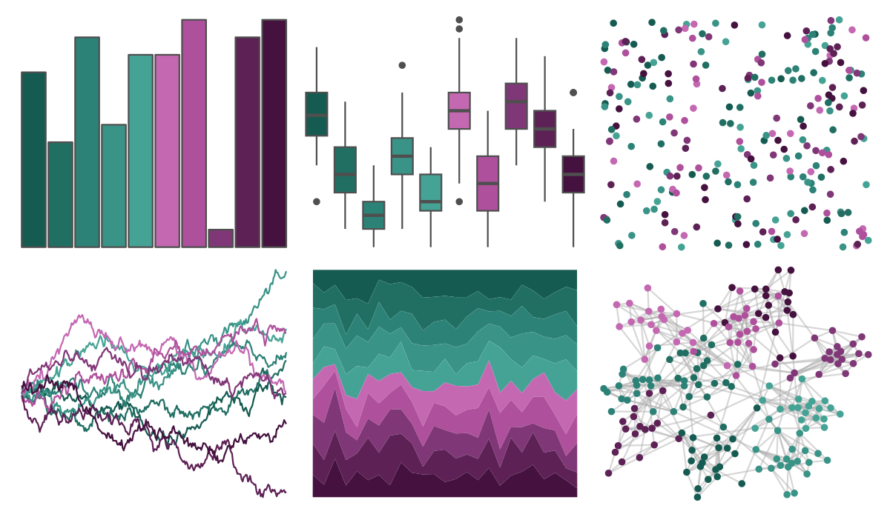

# MoMAColors - Doughton 

::: columns
::: {.column width="50%"}

**Github**

[BlakeRMills/MoMAColors](https://github.com/BlakeRMills/MoMAColors)
:::

::: {.column width="50%"}

**CRAN**

Not on CRAN
:::
:::

<hr> 

Use with [paletteer](https://emilhvitfeldt.github.io/paletteer/) package:

```r
library(paletteer)
paletteer_d("MoMAColors::Doughton")
```

Use raw:

```r
c("#155B51FF", "#216F63FF", "#2D8277FF", "#3A9387FF", "#45A395FF", "#C468B2FF", "#AF509CFF", "#803777FF", "#5D2155FF", "#45113FFF")
``` 

 

<br>

# Related Palettes

<div class="list" style="display: grid; grid-template-columns: auto auto auto;"> <figure class="figure">
<a href="../../awtools/a_palette/"> </a>
</figure> <figure class="figure">
<a href="../../ButterflyColors/hamadryas_feronia/"> </a>
</figure> <figure class="figure">
<a href="../../ButterflyColors/hamadryas_feronia/"> </a>
</figure> <figure class="figure">
<a href="../../lisa/GeorgiaOKeeffe/"> </a>
</figure> <figure class="figure">
<a href="../../rtist/okeeffe/"> </a>
</figure> <figure class="figure">
<a href="../../beyonce/X51/"> </a>
</figure> <figure class="figure">
<a href="../../yarrr/eternal/"> </a>
</figure> <figure class="figure">
<a href="../../NatParksPalettes/Yosemite/"> </a>
</figure> <figure class="figure">
<a href="../../MetBrewer/Hokusai2/"> </a>
</figure> <figure class="figure">
<a href="../../NineteenEightyR/electronic_night/"> </a>
</figure> <figure class="figure">
<a href="../../MexBrewer/Frida/"> </a>
</figure> <figure class="figure">
<a href="../../colRoz/physalia/"> </a>
</figure> 
</div>
