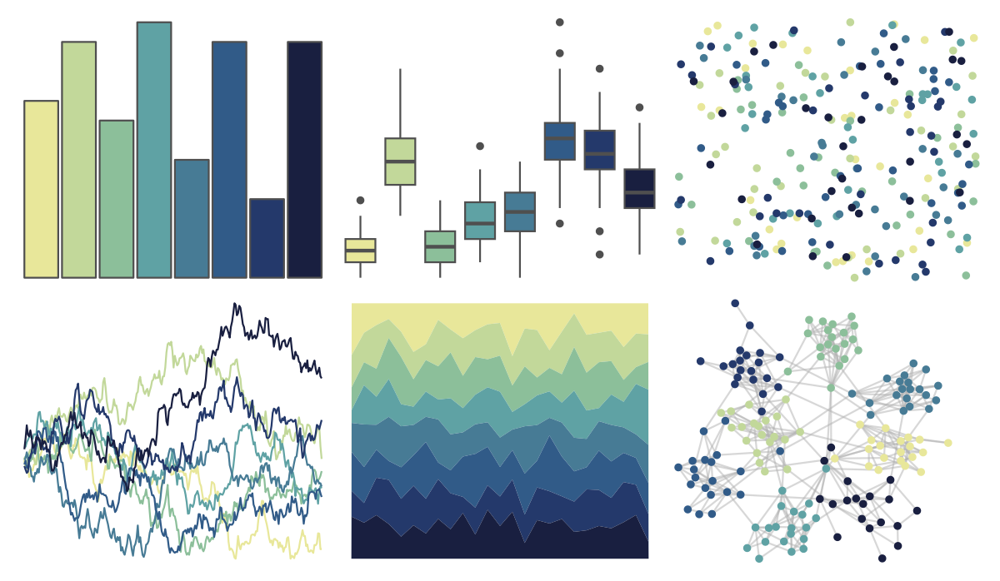

# MoMAColors - Ernst 

::: columns
::: {.column width="50%"}

**Github**

[BlakeRMills/MoMAColors](https://github.com/BlakeRMills/MoMAColors)
:::

::: {.column width="50%"}

**CRAN**

Not on CRAN
:::
:::

<hr> 

Use with [paletteer](https://emilhvitfeldt.github.io/paletteer/) package:

```r
library(paletteer)
paletteer_d("MoMAColors::Ernst")
```

Use raw:

```r
c("#E8E79AFF", "#C2D89AFF", "#8CBF9AFF", "#5FA2A4FF", "#477B95FF", "#315B88FF", "#24396BFF", "#191F40FF")
``` 

 

<br>

# Related Palettes

<div class="list" style="display: grid; grid-template-columns: auto auto auto;"> <figure class="figure">
<a href="../../awtools/a_palette/"> </a>
</figure> <figure class="figure">
<a href="../../ButterflyColors/hamadryas_feronia/"> </a>
</figure> <figure class="figure">
<a href="../../ButterflyColors/hamadryas_feronia/"> </a>
</figure> <figure class="figure">
<a href="../../ghibli/YesterdayMedium/"> </a>
</figure> <figure class="figure">
<a href="../../MoMAColors/VanGogh/"> </a>
</figure> <figure class="figure">
<a href="../../MetBrewer/Hokusai3/"> </a>
</figure> <figure class="figure">
<a href="../../vangogh/StarryRhone/"> </a>
</figure> <figure class="figure">
<a href="../../ButterflyColors/heliconius_sara_apseudes/"> </a>
</figure> <figure class="figure">
<a href="../../lisa/VincentvanGogh/"> </a>
</figure> <figure class="figure">
<a href="../../MetBrewer/Cassatt2/"> </a>
</figure> <figure class="figure">
<a href="../../rcartocolor/DarkMint/"> </a>
</figure> <figure class="figure">
<a href="../../MetBrewer/Derain/"> </a>
</figure> 
</div>
