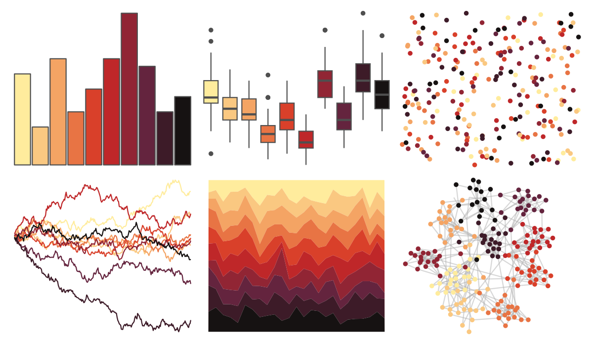
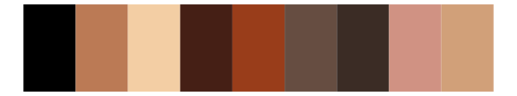
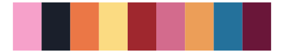

# MoMAColors - Exter 

::: columns
::: {.column width="50%"}

**Github**

[BlakeRMills/MoMAColors](https://github.com/BlakeRMills/MoMAColors)
:::

::: {.column width="50%"}

**CRAN**

Not on CRAN
:::
:::

<hr> 

Use with [paletteer](https://emilhvitfeldt.github.io/paletteer/) package:

```r
library(paletteer)
paletteer_d("MoMAColors::Exter")
```

Use raw:

```r
c("#FFEC9DFF", "#FAC881FF", "#F4A464FF", "#E87444FF", "#D9402AFF", "#BF2729FF", "#912534FF", "#64243EFF", "#3D1B28FF", "#161212FF")
``` 

 

<br>

# Related Palettes

<div class="list" style="display: grid; grid-template-columns: auto auto auto;"> <figure class="figure">
<a href="../../amerika/Dem_Ind_Rep3/"> </a>
</figure> <figure class="figure">
<a href="../../nationalparkcolors/Hawaii/"> </a>
</figure> <figure class="figure">
<a href="../../peRReo/badbunny2/"> </a>
</figure> <figure class="figure">
<a href="../../futurevisions/titan/"> </a>
</figure> <figure class="figure">
<a href="../../peRReo/don/"> </a>
</figure> <figure class="figure">
<a href="../../MexBrewer/Huida/"> </a>
</figure> <figure class="figure">
<a href="../../tvthemes/Sunstone/"> </a>
</figure> <figure class="figure">
<a href="../../dutchmasters/staalmeesters/"> </a>
</figure> <figure class="figure">
<a href="../../tvthemes/Ruby/"> </a>
</figure> <figure class="figure">
<a href="../../nbapalettes/jazz_city/"> </a>
</figure> <figure class="figure">
<a href="../../MexBrewer/Atentado/"> </a>
</figure> <figure class="figure">
<a href="../../jcolors/pal4/"> </a>
</figure> 
</div>
