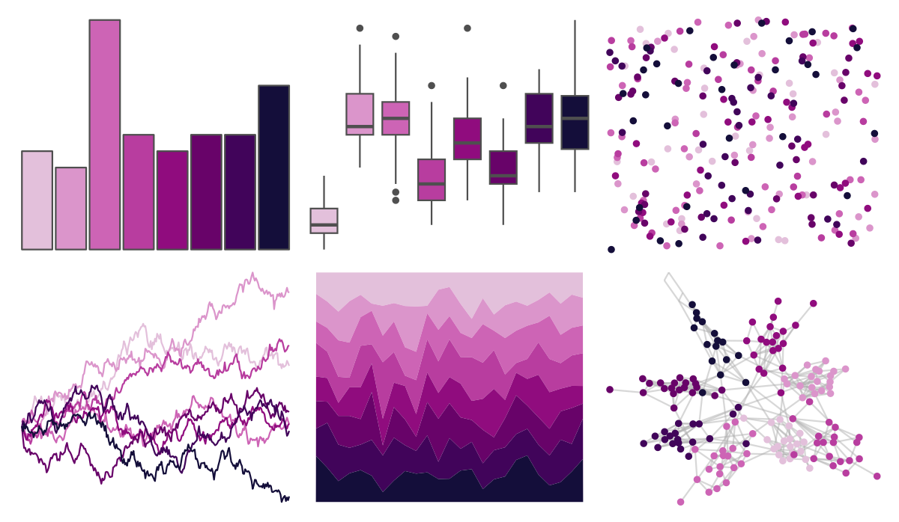

# MoMAColors - Flash 

::: columns
::: {.column width="50%"}

**Github**

[BlakeRMills/MoMAColors](https://github.com/BlakeRMills/MoMAColors)
:::

::: {.column width="50%"}

**CRAN**

Not on CRAN
:::
:::

<hr> 

Use with [paletteer](https://emilhvitfeldt.github.io/paletteer/) package:

```r
library(paletteer)
paletteer_d("MoMAColors::Flash")
```

Use raw:

```r
c("#E3C0DBFF", "#DB95CBFF", "#CD64B5FF", "#B83D9FFF", "#900C7EFF", "#680369FF", "#41045AFF", "#140E3AFF")
``` 

 

<br>

# Related Palettes

<div class="list" style="display: grid; grid-template-columns: auto auto auto;"> <figure class="figure">
<a href="../../amerika/Dem_Ind_Rep3/"> </a>
</figure> <figure class="figure">
<a href="../../beyonce/X27/"> </a>
</figure> <figure class="figure">
<a href="../../ggsci/purple_material/"> </a>
</figure> <figure class="figure">
<a href="../../ggsci/pink_bs5/"> </a>
</figure> <figure class="figure">
<a href="../../beyonce/X14/"> </a>
</figure> <figure class="figure">
<a href="../../ggsci/fuchsia_tw3/"> </a>
</figure> <figure class="figure">
<a href="../../rcartocolor/Magenta/"> </a>
</figure> <figure class="figure">
<a href="../../tvthemes/Sugilite/"> </a>
</figure> <figure class="figure">
<a href="../../NatParksPalettes/Arches2/"> </a>
</figure> <figure class="figure">
<a href="../../beyonce/X13/"> </a>
</figure> <figure class="figure">
<a href="../../ggprism/purple_passion/"> </a>
</figure> <figure class="figure">
<a href="../../tvthemes/Rhodonite/"> </a>
</figure> 
</div>
