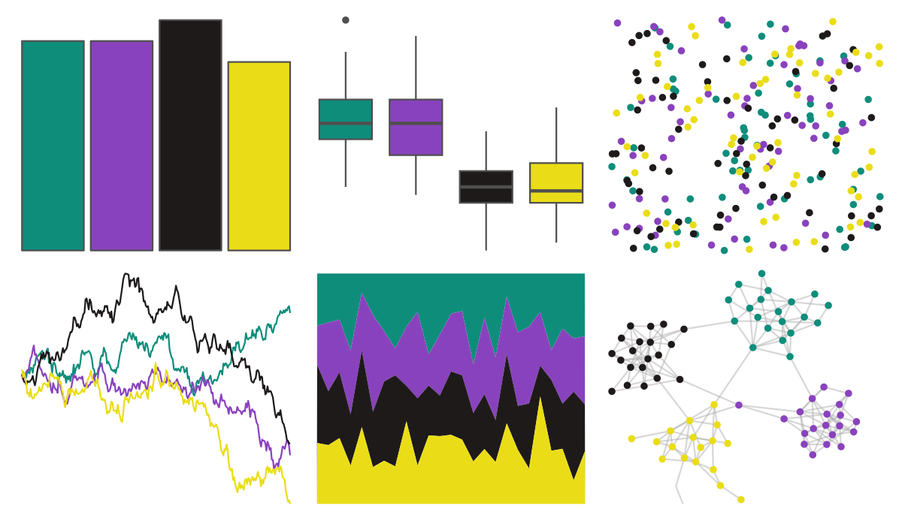

# MoMAColors - Fritsch 

::: columns
::: {.column width="50%"}

**Github**

[BlakeRMills/MoMAColors](https://github.com/BlakeRMills/MoMAColors)
:::

::: {.column width="50%"}

**CRAN**

Not on CRAN
:::
:::

<hr> 

Use with [paletteer](https://emilhvitfeldt.github.io/paletteer/) package:

```r
library(paletteer)
paletteer_d("MoMAColors::Fritsch")
```

Use raw:

```r
c("#0F8D7BFF", "#8942BDFF", "#1E1A1AFF", "#EADD17FF")
``` 

 

<br>

# Related Palettes

<div class="list" style="display: grid; grid-template-columns: auto auto auto;"> <figure class="figure">
<a href="../../amerika/Dem_Ind_Rep3/"> </a>
</figure> <figure class="figure">
<a href="../../fishualize/Chaetodon_pelewensis/"> </a>
</figure> <figure class="figure">
<a href="../../nbapalettes/timberwolves_classic/"> </a>
</figure> <figure class="figure">
<a href="../../nbapalettes/timberwolves/"> </a>
</figure> <figure class="figure">
<a href="../../MexBrewer/Casita2/"> </a>
</figure> <figure class="figure">
<a href="../../nbapalettes/mavericks_banner/"> </a>
</figure> <figure class="figure">
<a href="../../nbapalettes/timberwolves_00s/"> </a>
</figure> <figure class="figure">
<a href="../../fishualize/Acanthurus_olivaceus/"> </a>
</figure> <figure class="figure">
<a href="../../beyonce/X18/"> </a>
</figure> <figure class="figure">
<a href="../../nationalparkcolors/Acadia/"> </a>
</figure> <figure class="figure">
<a href="../../fishualize/Zebrasoma_velifer/"> </a>
</figure> <figure class="figure">
<a href="../../poisonfrogs/Rvariabilis/"> </a>
</figure> 
</div>
