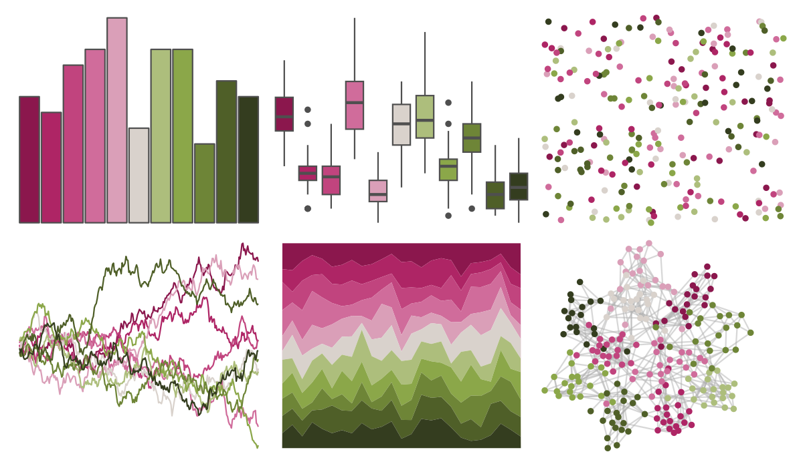

# MoMAColors - Kippenberger 

::: columns
::: {.column width="50%"}

**Github**

[BlakeRMills/MoMAColors](https://github.com/BlakeRMills/MoMAColors)
:::

::: {.column width="50%"}

**CRAN**

Not on CRAN
:::
:::

<hr> 

Use with [paletteer](https://emilhvitfeldt.github.io/paletteer/) package:

```r
library(paletteer)
paletteer_d("MoMAColors::Kippenberger")
```

Use raw:

```r
c("#8B174DFF", "#AE2565FF", "#C1447EFF", "#D06C9BFF", "#DA9FB8FF", "#D9D2CCFF", "#ADBE7CFF", "#8BA749FF", "#6E8537FF", "#4F5F28FF", "#343D1FFF")
``` 

 

<br>

# Related Palettes

<div class="list" style="display: grid; grid-template-columns: auto auto auto;"> <figure class="figure">
<a href="../../amerika/Dem_Ind_Rep3/"> </a>
</figure> <figure class="figure">
<a href="../../feathers/princess_parrot/"> </a>
</figure> <figure class="figure">
<a href="../../peRReo/shakira/"> </a>
</figure> <figure class="figure">
<a href="../../impressionist.colors/pres_du_lac/"> </a>
</figure> <figure class="figure">
<a href="../../MetBrewer/Redon/"> </a>
</figure> <figure class="figure">
<a href="../../MetBrewer/Cassatt2/"> </a>
</figure> <figure class="figure">
<a href="../../dutchmasters/milkmaid/"> </a>
</figure> <figure class="figure">
<a href="../../beyonce/X10/"> </a>
</figure> <figure class="figure">
<a href="../../Redmonder/dPBIYlPu/"> </a>
</figure> <figure class="figure">
<a href="../../calecopal/coastaldune2/"> </a>
</figure> <figure class="figure">
<a href="../../feathers/oriole/"> </a>
</figure> <figure class="figure">
<a href="../../ggthemr/grass/"> </a>
</figure> 
</div>
