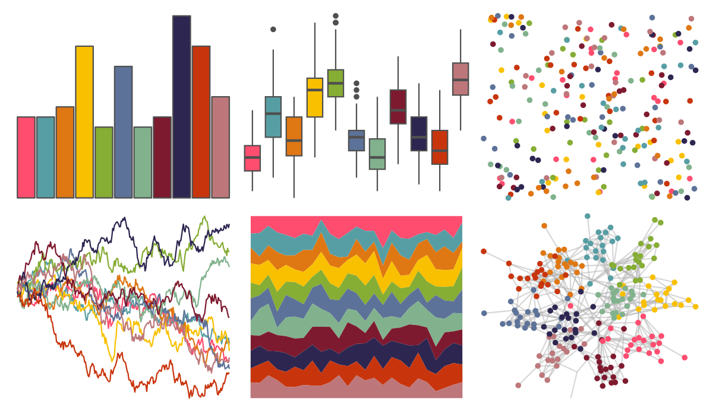

# MoMAColors - Klein 

::: columns
::: {.column width="50%"}

**Github**

[BlakeRMills/MoMAColors](https://github.com/BlakeRMills/MoMAColors)
:::

::: {.column width="50%"}

**CRAN**

Not on CRAN
:::
:::

<hr> 

Use with [paletteer](https://emilhvitfeldt.github.io/paletteer/) package:

```r
library(paletteer)
paletteer_d("MoMAColors::Klein")
```

Use raw:

```r
c("#FF4D6FFF", "#579EA4FF", "#DF7713FF", "#F9C000FF", "#86AD34FF", "#5D7298FF", "#81B28DFF", "#7E1A2FFF", "#2D2651FF", "#C8350DFF", "#BD777AFF")
``` 

 

<br>

# Related Palettes

<div class="list" style="display: grid; grid-template-columns: auto auto auto;"> <figure class="figure">
<a href="../../amerika/Dem_Ind_Rep3/"> </a>
</figure> <figure class="figure">
<a href="../../MetBrewer/Cross/"> </a>
</figure> <figure class="figure">
<a href="../../peRReo/calle13/"> </a>
</figure> <figure class="figure">
<a href="../../ggthemr/pale/"> </a>
</figure> <figure class="figure">
<a href="../../rcartocolor/Bold/"> </a>
</figure> <figure class="figure">
<a href="../../MetBrewer/Signac/"> </a>
</figure> <figure class="figure">
<a href="../../IslamicArt/shiraz/"> </a>
</figure> <figure class="figure">
<a href="../../tvthemes/CrazyLaceAgate/"> </a>
</figure> <figure class="figure">
<a href="../../ggsci/default_bmj/"> </a>
</figure> <figure class="figure">
<a href="../../DresdenColor/paired/"> </a>
</figure> <figure class="figure">
<a href="../../MetBrewer/Redon/"> </a>
</figure> <figure class="figure">
<a href="../../ggthemr/light/"> </a>
</figure> 
</div>
