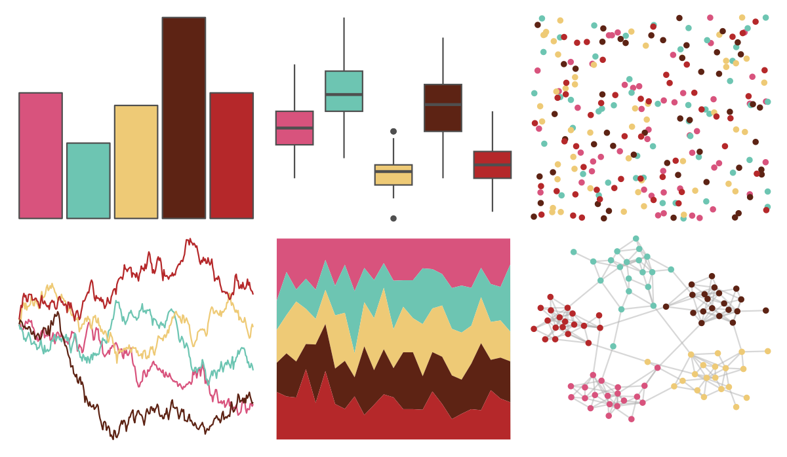

# MoMAColors - Koons 

::: columns
::: {.column width="50%"}

**Github**

[BlakeRMills/MoMAColors](https://github.com/BlakeRMills/MoMAColors)
:::

::: {.column width="50%"}

**CRAN**

Not on CRAN
:::
:::

<hr> 

Use with [paletteer](https://emilhvitfeldt.github.io/paletteer/) package:

```r
library(paletteer)
paletteer_d("MoMAColors::Koons")
```

Use raw:

```r
c("#D8537DFF", "#6DC5B2FF", "#EECA76FF", "#5D2314FF", "#B5282AFF")
``` 

 

<br>

# Related Palettes

<div class="list" style="display: grid; grid-template-columns: auto auto auto;"> <figure class="figure">
<a href="../../amerika/Dem_Ind_Rep3/"> </a>
</figure> <figure class="figure">
<a href="../../ltc/kiss/"> </a>
</figure> <figure class="figure">
<a href="../../fishualize/Nemateleotris_magnifica/"> </a>
</figure> <figure class="figure">
<a href="../../fishualize/Bodianus_pulchellus/"> </a>
</figure> <figure class="figure">
<a href="../../yarrr/cars/"> </a>
</figure> <figure class="figure">
<a href="../../werpals/alice/"> </a>
</figure> <figure class="figure">
<a href="../../lisa/AndyWarhol_2/"> </a>
</figure> <figure class="figure">
<a href="../../ltc/dora/"> </a>
</figure> <figure class="figure">
<a href="../../lisa/JamesJean/"> </a>
</figure> <figure class="figure">
<a href="../../fishualize/Lutjanus_sebae/"> </a>
</figure> <figure class="figure">
<a href="../../NineteenEightyR/sunset1/"> </a>
</figure> <figure class="figure">
<a href="../../fishualize/Pseudocheilinus_tetrataenia/"> </a>
</figure> 
</div>
