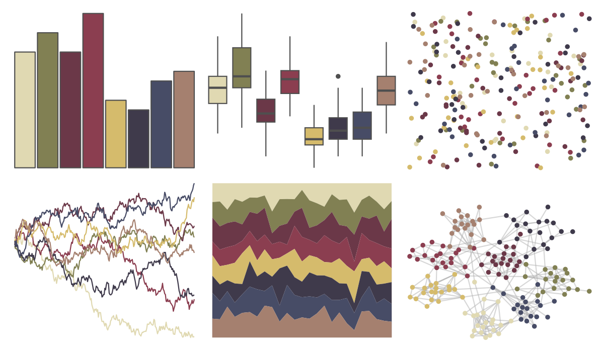

# MoMAColors - Levine1 

::: columns
::: {.column width="50%"}

**Github**

[BlakeRMills/MoMAColors](https://github.com/BlakeRMills/MoMAColors)
:::

::: {.column width="50%"}

**CRAN**

Not on CRAN
:::
:::

<hr> 

Use with [paletteer](https://emilhvitfeldt.github.io/paletteer/) package:

```r
library(paletteer)
paletteer_d("MoMAColors::Levine1")
```

Use raw:

```r
c("#E0D9B2FF", "#818053FF", "#6B3848FF", "#8B3E50FF", "#D5BB6CFF", "#3F3A4BFF", "#474C66FF", "#A5806FFF")
``` 

 

<br>

# Related Palettes

<div class="list" style="display: grid; grid-template-columns: auto auto auto;"> <figure class="figure">
<a href="../../awtools/a_palette/"> </a>
</figure> <figure class="figure">
<a href="../../ButterflyColors/hamadryas_feronia/"> </a>
</figure> <figure class="figure">
<a href="../../ButterflyColors/hamadryas_feronia/"> </a>
</figure> <figure class="figure">
<a href="../../IslamicArt/alhambra/"> </a>
</figure> <figure class="figure">
<a href="../../impressionist.colors/bouilloire_et_fruits/"> </a>
</figure> <figure class="figure">
<a href="../../lisa/MaxErnst/"> </a>
</figure> <figure class="figure">
<a href="../../peRReo/wyy/"> </a>
</figure> <figure class="figure">
<a href="../../MoMAColors/Levine2/"> </a>
</figure> <figure class="figure">
<a href="../../calecopal/grasswet/"> </a>
</figure> <figure class="figure">
<a href="../../MexBrewer/Alacena/"> </a>
</figure> <figure class="figure">
<a href="../../calecopal/grassdry/"> </a>
</figure> <figure class="figure">
<a href="../../feathers/oriole/"> </a>
</figure> 
</div>
