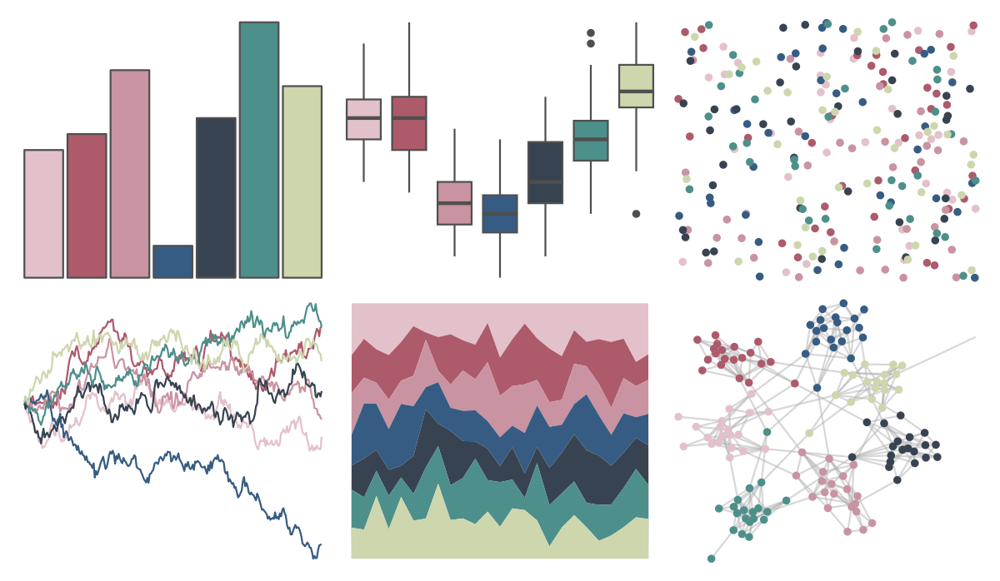
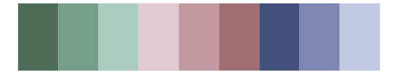

# MoMAColors - Levine2 

::: columns
::: {.column width="50%"}

**Github**

[BlakeRMills/MoMAColors](https://github.com/BlakeRMills/MoMAColors)
:::

::: {.column width="50%"}

**CRAN**

Not on CRAN
:::
:::

<hr> 

Use with [paletteer](https://emilhvitfeldt.github.io/paletteer/) package:

```r
library(paletteer)
paletteer_d("MoMAColors::Levine2")
```

Use raw:

```r
c("#E3C1CBFF", "#AD5A6BFF", "#C993A2FF", "#365C83FF", "#384351FF", "#4D8F8BFF", "#CDD6ADFF")
``` 

 

<br>

# Related Palettes

<div class="list" style="display: grid; grid-template-columns: auto auto auto;"> <figure class="figure">
<a href="../../amerika/Dem_Ind_Rep3/"> </a>
</figure> <figure class="figure">
<a href="../../impressionist.colors/la_chanson_du_chien/"> </a>
</figure> <figure class="figure">
<a href="../../MetBrewer/Monet/"> </a>
</figure> <figure class="figure">
<a href="../../fishualize/Oncorhynchus_nerka/"> </a>
</figure> <figure class="figure">
<a href="../../MoMAColors/Levine1/"> </a>
</figure> <figure class="figure">
<a href="../../nord/baie_mouton/"> </a>
</figure> <figure class="figure">
<a href="../../lisa/TheovanDoesburg/"> </a>
</figure> <figure class="figure">
<a href="../../MexBrewer/Alacena/"> </a>
</figure> <figure class="figure">
<a href="../../lisa/ClaudeMonet_1/"> </a>
</figure> <figure class="figure">
<a href="../../DresdenColor/deathmasks/"> </a>
</figure> <figure class="figure">
<a href="../../colRoz/salt_lake/"> </a>
</figure> <figure class="figure">
<a href="../../ochRe/parliament/"> </a>
</figure> 
</div>
