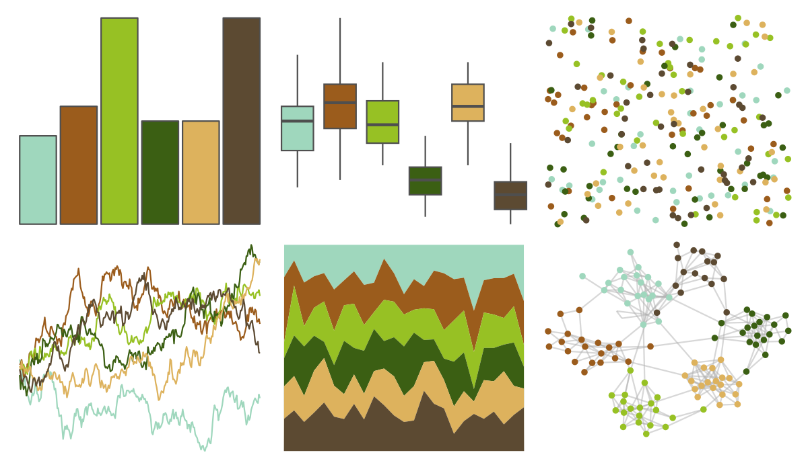

# MoMAColors - Liu 

::: columns
::: {.column width="50%"}

**Github**

[BlakeRMills/MoMAColors](https://github.com/BlakeRMills/MoMAColors)
:::

::: {.column width="50%"}

**CRAN**

Not on CRAN
:::
:::

<hr> 

Use with [paletteer](https://emilhvitfeldt.github.io/paletteer/) package:

```r
library(paletteer)
paletteer_d("MoMAColors::Liu")
```

Use raw:

```r
c("#9FD7BDFF", "#9B5C1CFF", "#97C124FF", "#3B5F13FF", "#DDB25DFF", "#5C4A32FF")
``` 

 

<br>

# Related Palettes

<div class="list" style="display: grid; grid-template-columns: auto auto auto;"> <figure class="figure">
<a href="../../awtools/a_palette/"> </a>
</figure> <figure class="figure">
<a href="../../ButterflyColors/hamadryas_feronia/"> </a>
</figure> <figure class="figure">
<a href="../../ButterflyColors/hamadryas_feronia/"> </a>
</figure> <figure class="figure">
<a href="../../lisa/RemediosVaro/"> </a>
</figure> <figure class="figure">
<a href="../../wesanderson/Cavalcanti1/"> </a>
</figure> <figure class="figure">
<a href="../../lisa/SandySkoglund/"> </a>
</figure> <figure class="figure">
<a href="../../calecopal/agriculture/"> </a>
</figure> <figure class="figure">
<a href="../../colRoz/p_mitchelli/"> </a>
</figure> <figure class="figure">
<a href="../../colRoz/nq_stream/"> </a>
</figure> <figure class="figure">
<a href="../../Manu/Kakapo/"> </a>
</figure> <figure class="figure">
<a href="../../Manu/Titipounamu/"> </a>
</figure> <figure class="figure">
<a href="../../nationalparkcolors/Yellowstone/"> </a>
</figure> 
</div>
