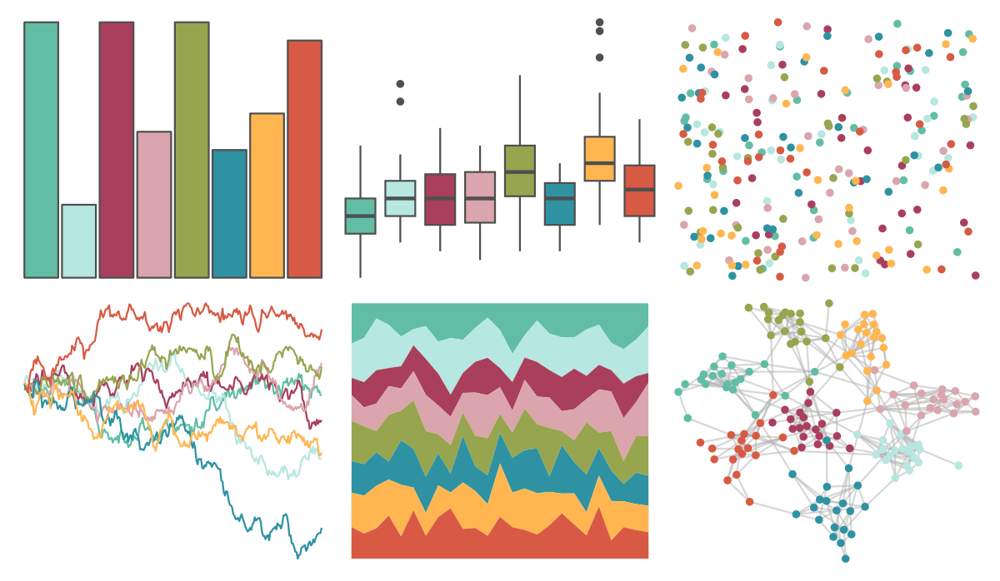
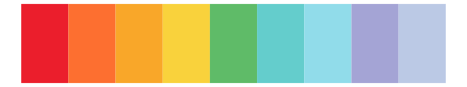

# MoMAColors - Lupi 

::: columns
::: {.column width="50%"}

**Github**

[BlakeRMills/MoMAColors](https://github.com/BlakeRMills/MoMAColors)
:::

::: {.column width="50%"}

**CRAN**

Not on CRAN
:::
:::

<hr> 

Use with [paletteer](https://emilhvitfeldt.github.io/paletteer/) package:

```r
library(paletteer)
paletteer_d("MoMAColors::Lupi")
```

Use raw:

```r
c("#61BEA4FF", "#B6E7E0FF", "#AA3F5DFF", "#DAA5ACFF", "#98A54FFF", "#2E92A2FF", "#FFB651FF", "#D85A44FF")
``` 

 

<br>

# Related Palettes

<div class="list" style="display: grid; grid-template-columns: auto auto auto;"> <figure class="figure">
<a href="../../amerika/Dem_Ind_Rep3/"> </a>
</figure> <figure class="figure">
<a href="../../waRhol/marilyn_orange_62/"> </a>
</figure> <figure class="figure">
<a href="../../ggthemes/Summer/"> </a>
</figure> <figure class="figure">
<a href="../../MetBrewer/Hiroshige/"> </a>
</figure> <figure class="figure">
<a href="../../ggthemes/Tableau_10/"> </a>
</figure> <figure class="figure">
<a href="../../PrettyCols/Lucent/"> </a>
</figure> <figure class="figure">
<a href="../../rcartocolor/Temps/"> </a>
</figure> <figure class="figure">
<a href="../../ggthemes/Jewel_Bright/"> </a>
</figure> <figure class="figure">
<a href="../../NatParksPalettes/Yellowstone/"> </a>
</figure> <figure class="figure">
<a href="../../ggthemes/excel_Badge/"> </a>
</figure> <figure class="figure">
<a href="../../ggthemes/excel_Berlin/"> </a>
</figure> <figure class="figure">
<a href="../../nationalparkcolors/ArcticGates/"> </a>
</figure> 
</div>
