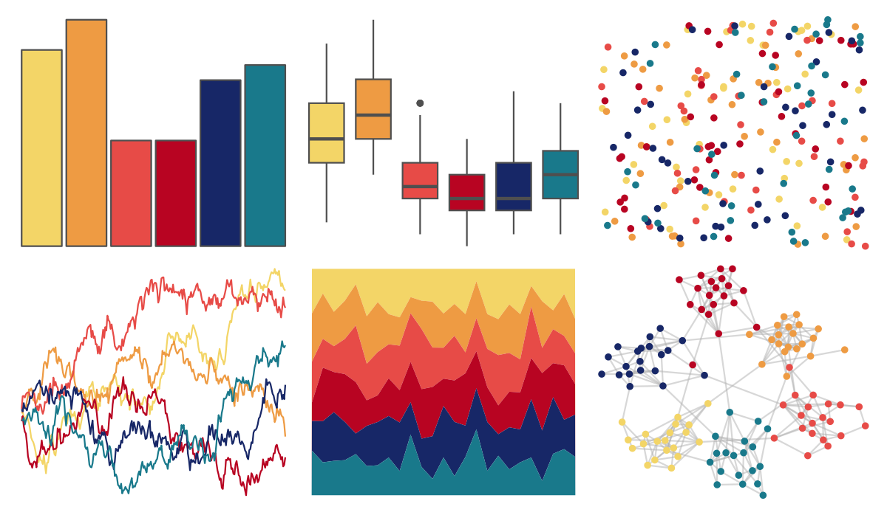

# MoMAColors - OKeeffe 

::: columns
::: {.column width="50%"}

**Github**

[BlakeRMills/MoMAColors](https://github.com/BlakeRMills/MoMAColors)
:::

::: {.column width="50%"}

**CRAN**

Not on CRAN
:::
:::

<hr> 

Use with [paletteer](https://emilhvitfeldt.github.io/paletteer/) package:

```r
library(paletteer)
paletteer_d("MoMAColors::OKeeffe")
```

Use raw:

```r
c("#F3D567FF", "#EE9B43FF", "#E74B47FF", "#B80422FF", "#172767FF", "#19798BFF")
``` 

 

<br>

# Related Palettes

<div class="list" style="display: grid; grid-template-columns: auto auto auto;"> <figure class="figure">
<a href="../../amerika/Dem_Ind_Rep3/"> </a>
</figure> <figure class="figure">
<a href="../../MetBrewer/Tam/"> </a>
</figure> <figure class="figure">
<a href="../../PNWColors/Bay/"> </a>
</figure> <figure class="figure">
<a href="../../suffrager/london/"> </a>
</figure> <figure class="figure">
<a href="../../MetBrewer/Archambault/"> </a>
</figure> <figure class="figure">
<a href="../../trekcolors/enara/"> </a>
</figure> <figure class="figure">
<a href="../../MetBrewer/Johnson/"> </a>
</figure> <figure class="figure">
<a href="../../lisa/EdvardMunch/"> </a>
</figure> <figure class="figure">
<a href="../../soilpalettes/redox2/"> </a>
</figure> <figure class="figure">
<a href="../../fishualize/Pronotogrammus_martinicensis/"> </a>
</figure> <figure class="figure">
<a href="../../tvthemes/CrazyLaceAgate/"> </a>
</figure> <figure class="figure">
<a href="../../peRReo/badbunny2/"> </a>
</figure> 
</div>
