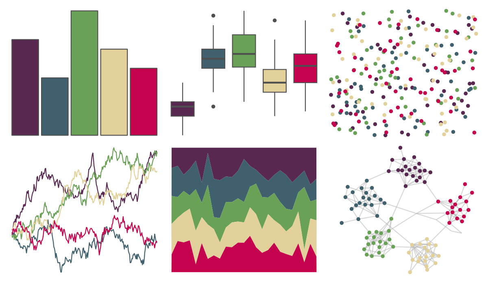

# MoMAColors - Ohchi 

::: columns
::: {.column width="50%"}

**Github**

[BlakeRMills/MoMAColors](https://github.com/BlakeRMills/MoMAColors)
:::

::: {.column width="50%"}

**CRAN**

Not on CRAN
:::
:::

<hr> 

Use with [paletteer](https://emilhvitfeldt.github.io/paletteer/) package:

```r
library(paletteer)
paletteer_d("MoMAColors::Ohchi")
```

Use raw:

```r
c("#582851FF", "#40606DFF", "#69A257FF", "#E3D19CFF", "#C4024DFF")
``` 

 

<br>

# Related Palettes

<div class="list" style="display: grid; grid-template-columns: auto auto auto;"> <figure class="figure">
<a href="../../amerika/Dem_Ind_Rep3/"> </a>
</figure> <figure class="figure">
<a href="../../waRhol/bighorn_ram_83/"> </a>
</figure> <figure class="figure">
<a href="../../trekcolors/bajoran/"> </a>
</figure> <figure class="figure">
<a href="../../lisa/LeeKrasner/"> </a>
</figure> <figure class="figure">
<a href="../../PrettyCols/Relax/"> </a>
</figure> <figure class="figure">
<a href="../../RSkittleBrewer/wildberry/"> </a>
</figure> <figure class="figure">
<a href="../../lisa/EdwardHopper/"> </a>
</figure> <figure class="figure">
<a href="../../LaCroixColoR/MurePepino/"> </a>
</figure> <figure class="figure">
<a href="../../NatParksPalettes/Volcanoes/"> </a>
</figure> <figure class="figure">
<a href="../../rockthemes/husker/"> </a>
</figure> <figure class="figure">
<a href="../../PrettyCols/Bold/"> </a>
</figure> <figure class="figure">
<a href="../../lisa/JamesRosenquist/"> </a>
</figure> 
</div>
